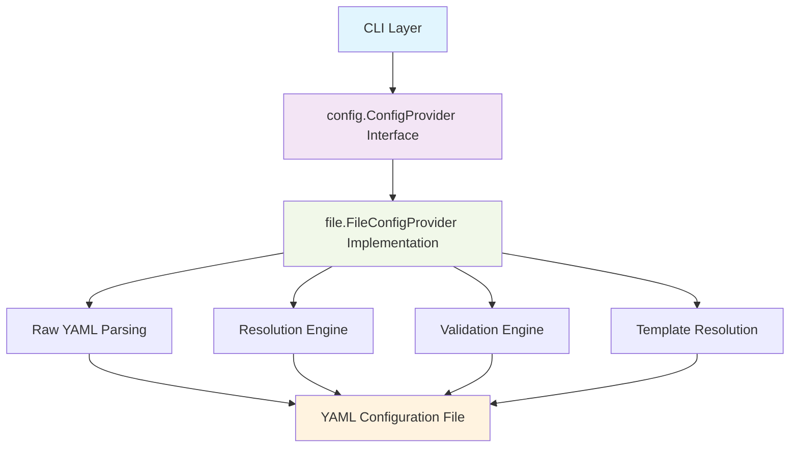
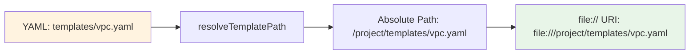
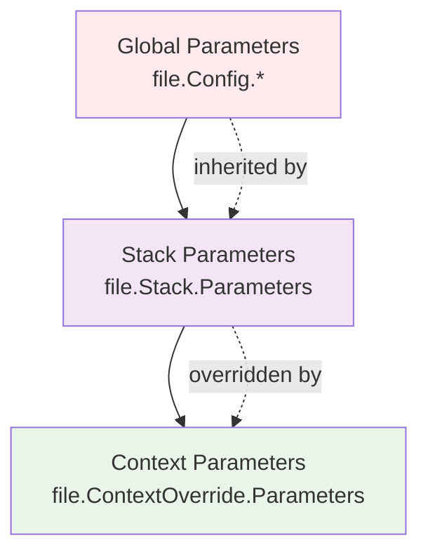
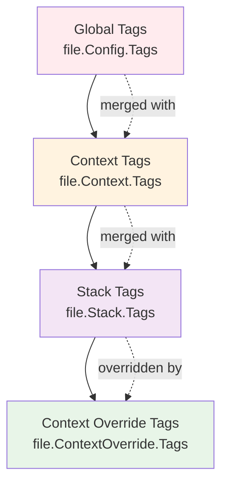
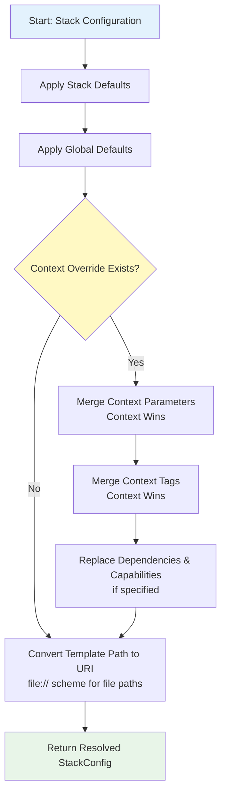

# Configuration System Architecture

## Overview

The Stackaroo configuration system provides a flexible, pluggable architecture for managing CloudFormation stack deployments across multiple environments. The system is built around the principles established in our Architecture Decision Records ([ADR 0008](decisions/0008-configuration-abstraction.md), [ADR 0009](decisions/0009-configuration-context-abstraction.md), and [ADR 0010](decisions/0010-file-provider-configuration-structure.md)) and implements a provider abstraction pattern that supports multiple configuration sources.

## Architecture Principles

The configuration system follows these core architectural principles:

### **1. Provider Abstraction ([ADR 0008](decisions/0008-configuration-abstraction.md))**
- Pluggable configuration providers enable different teams to use various configuration strategies
- Common interface abstracts implementation details from consumers
- Easy to extend with new provider types (Git-based, API-based, etc.)

### **2. Context-Based Selection ([ADR 0009](decisions/0009-configuration-context-abstraction.md))**
- Generic "context" parameter replaces environment-specific assumptions
- Providers interpret context according to their organizational model
- No semantic constraints imposed by the framework

### **3. CDK/Pulumi-Style Structure ([ADR 0010](decisions/0010-file-provider-configuration-structure.md))**
- Contexts combine logical grouping with deployment targets
- Parameter inheritance hierarchy: global → stack → context
- Account and region specification per context

## Component Architecture



## Core Interfaces

### **ConfigProvider Interface**

```go
type ConfigProvider interface {
    // LoadConfig loads configuration for a specific context
    LoadConfig(ctx context.Context, context string) (*Config, error)
    
    // ListContexts returns all available contexts
    ListContexts() ([]string, error)
    
    // GetStack returns stack configuration for specific stack and context
    GetStack(stackName, context string) (*StackConfig, error)
    
    // Validate checks configuration for consistency and errors
    Validate() error
}
```

**Key Design Decisions:**
- **Context-agnostic**: Uses generic `context` string parameter
- **Lazy loading**: Configuration loaded on-demand
- **Granular access**: Can fetch individual stacks or full configuration
- **Validation support**: Built-in consistency checking

### **Configuration Data Structures**

#### **Resolved Configuration (`config.Config`)**
Represents fully resolved configuration for a specific context:

```go
type Config struct {
    Project string              // Project name
    Region  string              // Global default region
    Tags    map[string]string   // Global tags
    Context *ContextConfig      // Resolved context
    Stacks  []*StackConfig      // Resolved stacks
}
```

#### **Resolved Context (`config.ContextConfig`)**
Represents deployment target information:

```go
type ContextConfig struct {
    Name    string              // Context name
    Account string              // AWS account ID
    Region  string              // AWS region
    Tags    map[string]string   // Context-specific tags
}
```

#### **Resolved Stack (`config.StackConfig`)**
Represents stack configuration with context overrides applied:

```go
type StackConfig struct {
    Name         string            // Stack name
    Template     string            // Template URI (file://, s3://, git://, etc.)
    Parameters   map[string]string // Resolved parameters
    Tags         map[string]string // Resolved tags
    Dependencies []string          // Stack dependencies
    Capabilities []string          // CloudFormation capabilities
}
```

## File Provider Implementation

### **Architecture Pattern**

The file provider follows a **two-phase resolution pattern**:

1. **Raw Parsing Phase**: Parse YAML into raw data structures
2. **Resolution Phase**: Apply inheritance and context overrides

### **Raw YAML Types (`file` package)**

These types represent the raw YAML structure before resolution:

#### **Raw Config (`file.Config`)**
```go
type Config struct {
    Project  string              `yaml:"project"`
    Region   string              `yaml:"region"`
    Tags     map[string]string   `yaml:"tags"`
    Contexts map[string]*Context `yaml:"contexts"`
    Stacks   []*Stack            `yaml:"stacks"`
}
```

#### **Raw Context (`file.Context`)**
```go
type Context struct {
    Account string            `yaml:"account"`
    Region  string            `yaml:"region"`
    Tags    map[string]string `yaml:"tags"`
}
```

#### **Raw Stack (`file.Stack`)**
```go
type Stack struct {
    Name         string                      `yaml:"name"`
    Template     string                      `yaml:"template"`
    Parameters   map[string]string           `yaml:"parameters"`
    Tags         map[string]string           `yaml:"tags"`
    Dependencies []string                    `yaml:"depends_on"`
    Capabilities []string                    `yaml:"capabilities"`
    Contexts     map[string]*ContextOverride `yaml:"contexts"`
}
```

### **Resolution Engine**

#### **Template URI Resolution**

The file provider converts relative template paths to `file://` URIs during resolution:



#### **Parameter Inheritance Hierarchy**

Parameters are resolved using a three-level inheritance hierarchy:



#### **Tag Inheritance Hierarchy**

Tags follow the same pattern with merge semantics:



#### **Resolution Algorithm**



## YAML Configuration Structure

### **Complete Example**

```yaml
# Global configuration
project: my-infrastructure
region: us-east-1
tags:
  ManagedBy: stackaroo
  Owner: platform-team

# Context definitions (deployment targets)
contexts:
  dev:
    account: "123456789012"
    region: us-west-2
    tags:
      Environment: dev
      CostCenter: engineering
      
  staging:
    account: "123456789012"
    region: us-east-1
    tags:
      Environment: staging
      CostCenter: engineering
      
  prod:
    account: "987654321098"
    region: us-east-1
    tags:
      Environment: prod
      CostCenter: production

# Stack definitions
stacks:
  - name: vpc
    template: templates/vpc.yaml
    parameters:
      VpcCidr: 10.0.0.0/16
      EnableDnsHostnames: "true"
    tags:
      Component: networking
    capabilities:
      - CAPABILITY_IAM
    contexts:
      dev:
        parameters:
          VpcCidr: 10.1.0.0/16
      prod:
        parameters:
          VpcCidr: 10.2.0.0/16
        tags:
          Component: prod-networking
          
  - name: database
    template: templates/rds.yaml
    depends_on: [vpc]
    parameters:
      DBInstanceClass: db.t3.micro
    contexts:
      prod:
        parameters:
          DBInstanceClass: db.t3.small
          MultiAZ: "true"
```

### **Section Breakdown**

#### **Global Section**
- `project`: Project identifier
- `region`: Default AWS region for all contexts
- `tags`: Default tags applied to all resources

#### **Contexts Section**
- `account`: AWS account ID for deployment
- `region`: AWS region (overrides global default)
- `tags`: Context-specific tags (merged with global tags)

#### **Stacks Section**
- `name`: Unique stack identifier
- `template`: Path to CloudFormation template (relative to config file)
- `parameters`: Default stack parameters
- `tags`: Default stack tags
- `depends_on`: Stack dependencies (for deployment ordering)
- `capabilities`: CloudFormation capabilities required
- `contexts`: Context-specific overrides

## Usage Patterns

### **Provider Factory Methods**

The file provider offers two creation methods to support different architectural needs:

```go
// Method 1: Explicit filename (for custom config files)
provider := file.NewFileConfigProvider("custom-config.yaml")

// Method 2: Default factory (recommended - no hardcoded filenames)
provider := file.NewDefaultProvider()  // Uses "stackaroo.yaml"
```

**Architectural Benefits of `NewDefaultProvider()`:**
- **Encapsulates filename knowledge** - Consumer modules don't need to know config filename
- **Consistent defaults** - All applications use same config file name
- **Easy configuration** - Single source of truth for default behavior
- **Testable** - Mock providers can use different factory implementations

### **Loading Configuration**

```go
// Create file provider with default config file
provider := file.NewDefaultProvider()

// Load configuration for specific context
cfg, err := provider.LoadConfig(ctx, "prod")
if err != nil {
    return fmt.Errorf("failed to load config: %w", err)
}

// Access resolved configuration
fmt.Printf("Deploying to account: %s\n", cfg.Context.Account)
fmt.Printf("Region: %s\n", cfg.Context.Region)
fmt.Printf("Stacks: %d\n", len(cfg.Stacks))
```

### **Individual Stack Access**

```go
// Get specific stack configuration for context
stack, err := provider.GetStack("vpc", "dev")
if err != nil {
    return fmt.Errorf("stack not found: %w", err)
}

fmt.Printf("VPC CIDR for dev: %s\n", stack.Parameters["VpcCidr"])
```

### **Context Discovery**

```go
// List all available contexts
contexts, err := provider.ListContexts()
if err != nil {
    return fmt.Errorf("failed to list contexts: %w", err)
}

fmt.Printf("Available contexts: %s\n", strings.Join(contexts, ", "))
```

### **Configuration Validation**

```go
// Validate configuration consistency
if err := provider.Validate(); err != nil {
    return fmt.Errorf("configuration is invalid: %w", err)
}
```

## Template URI Resolution

Template paths in YAML configuration are converted to URIs by the file provider:

```
Project Structure:
├── stackaroo.yaml
├── templates/
│   ├── vpc.yaml
│   └── rds.yaml
└── modules/
    └── shared/
        └── security-groups.yaml

YAML Configuration:
stacks:
  - name: vpc
    template: templates/vpc.yaml        # → file:///project/templates/vpc.yaml
  - name: security
    template: modules/shared/sg.yaml   # → file:///project/modules/shared/sg.yaml
  - name: absolute
    template: /path/to/template.yaml   # → file:///path/to/template.yaml (absolute)
  - name: s3-template
    template: s3://bucket/template.yaml # → s3://bucket/template.yaml (URI passthrough)
```

## Validation Features

The configuration system performs several validation checks:

### **Context Reference Validation**
- Ensures all context references in stack overrides exist
- Prevents dangling context references

### **Template URI Validation**
- Checks that template files exist on disk (for file:// URIs)
- Resolves paths relative to configuration file before URI conversion

### **YAML Structure Validation**
- Validates YAML syntax and structure
- Ensures required fields are present

### **Future Validation Enhancements**
- CloudFormation template syntax validation
- Parameter type validation against template requirements
- Circular dependency detection
- Account/region accessibility checks
- URI scheme validation (file://, s3://, git://)

## Performance Characteristics

### **Lazy Loading**
- Configuration file is only parsed when first accessed
- Subsequent operations use cached parsed configuration
- Memory efficient for large configuration files

### **Context Resolution**
- Resolution happens on-demand per context
- No preprocessing of all contexts
- Efficient for contexts that are never accessed

### **Template Path Caching**
- Template paths resolved once and cached
- Reduces file system operations

## Error Handling

The configuration system provides detailed error messages:

### **File Errors**
```
failed to read config file 'stackaroo.yaml': no such file or directory
```

### **YAML Parsing Errors**
```
failed to parse YAML config file 'stackaroo.yaml': line 15: found character that cannot start any token
```

### **Context Errors**
```
context 'production' not found in configuration
```

### **Stack Errors**
```
stack 'database' not found in configuration
```

### **Validation Errors**
```
stack 'vpc' references undefined context 'nonexistent-context'
template file not found for stack 'vpc': templates/missing.yaml
```

## Extension Points

### **New Provider Types**

The system is designed for extension with new provider types:

```go
// Git-based provider
type GitProvider struct {
    repository string
    branch     string
}

func (gp *GitProvider) LoadConfig(ctx context.Context, context string) (*config.Config, error) {
    // Implementation: checkout branch, load config, resolve context
}

// API-based provider
type APIProvider struct {
    endpoint string
    apiKey   string
}

func (ap *APIProvider) LoadConfig(ctx context.Context, context string) (*config.Config, error) {
    // Implementation: HTTP request to API, parse response, resolve context
}
```

### **Custom Context Interpretation**

Providers can implement custom context interpretation logic:

```go
// Branch-based context provider
func (gp *GitProvider) LoadConfig(ctx context.Context, context string) (*config.Config, error) {
    // context = "feature/vpc-updates" → checkout feature/vpc-updates branch
    // context = "v1.2.3" → checkout tag v1.2.3
    // context = "main" → checkout main branch
}

// Multi-dimensional context provider
func (mp *MultiProvider) LoadConfig(ctx context.Context, context string) (*config.Config, error) {
    // context = "prod:us-east-1" → production environment, us-east-1 region
    // context = "dev:eu-west-1" → development environment, eu-west-1 region
}
```

## Testing Architecture

The configuration system follows the testing patterns established in [ADR 0011](decisions/0011-testing-framework-and-strategy.md):

### **Unit Tests**
- Fast, isolated tests for each component
- Mock file system operations for error scenarios
- Test all inheritance and resolution logic

### **Integration Tests**
- End-to-end tests with real YAML files
- Template path resolution validation
- Context resolution validation

### **Test File Management**
```go
// Temporary test files created in test directories
func createTempConfigFile(t *testing.T, content string) string {
    tmpDir := t.TempDir()
    tmpFile := tmpDir + "/stackaroo.yaml"
    
    err := os.WriteFile(tmpFile, []byte(content), 0644)
    require.NoError(t, err)
    
    return tmpFile
}
```

## Security Considerations

### **URI Security**
- Template paths are resolved safely to file:// URIs relative to config file
- Absolute paths are converted to absolute file:// URIs but logged for audit
- URI scheme validation prevents malicious schemes
- No access outside project directory by default for relative paths

### **Sensitive Data Handling**
- Configuration files may contain AWS account IDs
- No credential storage in configuration files
- Rely on AWS credential chain for authentication

### **Validation Security**
- Template file existence checks prevent path traversal
- YAML parsing uses safe parsing (no code execution)
- Context validation prevents injection attacks

## Future Enhancements

### **Configuration Features**
- Environment variable interpolation in YAML
- Include/import directives for modular configuration
- Configuration file versioning and migration
- Schema validation with detailed error messages
- Support for additional URI schemes (s3://, git://, http://)

### **Provider Features**
- HTTP-based configuration provider
- Database-backed configuration provider
- Encrypted configuration support
- Configuration change tracking and audit logs

### **Integration Features**
- IDE plugins for configuration validation
- CI/CD pipeline integration
- Configuration drift detection
- Automated parameter discovery from templates