# Delete Module Architecture

## Overview

The delete module provides safe, dependency-aware deletion of CloudFormation stacks with comprehensive confirmation mechanisms. It ensures stacks are deleted in reverse dependency order to prevent AWS failures, while requiring explicit user confirmation for all destructive operations.

## Architecture Diagram

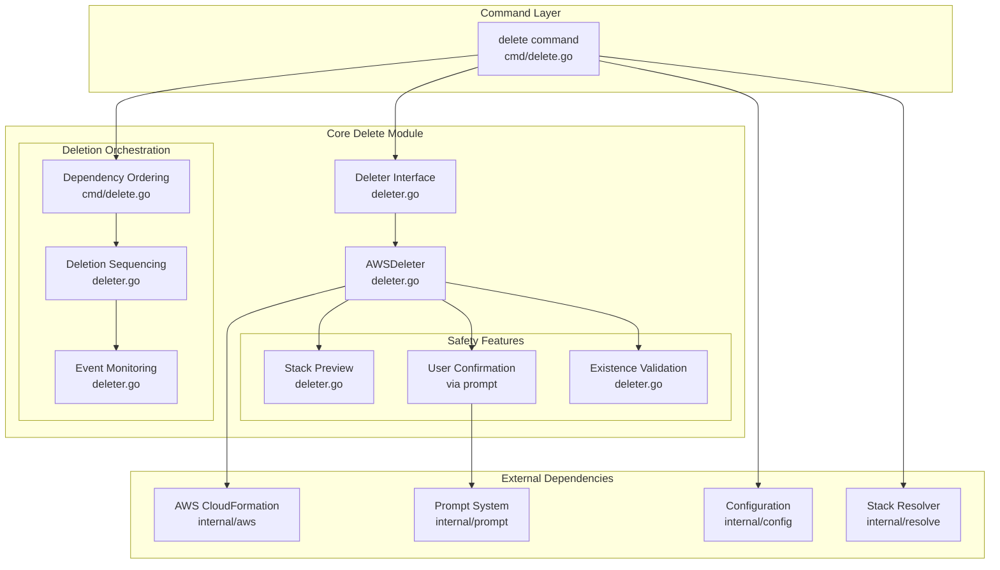

## Component Architecture

### 1. Command Layer (`cmd/delete.go`)

**Responsibility:** CLI interface, dependency resolution, and deletion orchestration

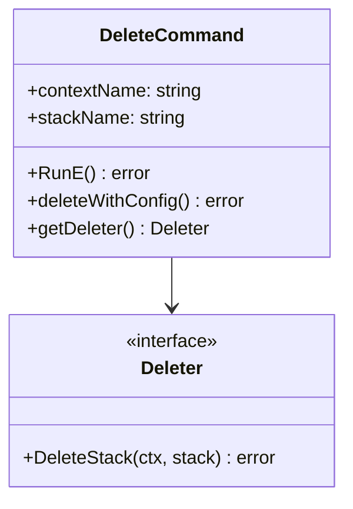

**Key Features:**
- Single and multiple stack deletion support
- Automatic dependency resolution and reverse ordering
- Configuration integration
- Error handling with proper exit codes

**Dependency Ordering Logic:**
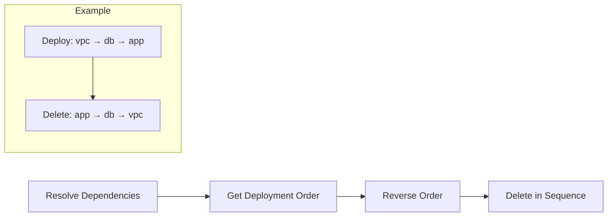

### 2. Core Delete Engine (`internal/delete/`)

#### 2.1 Deleter Interface and Implementation

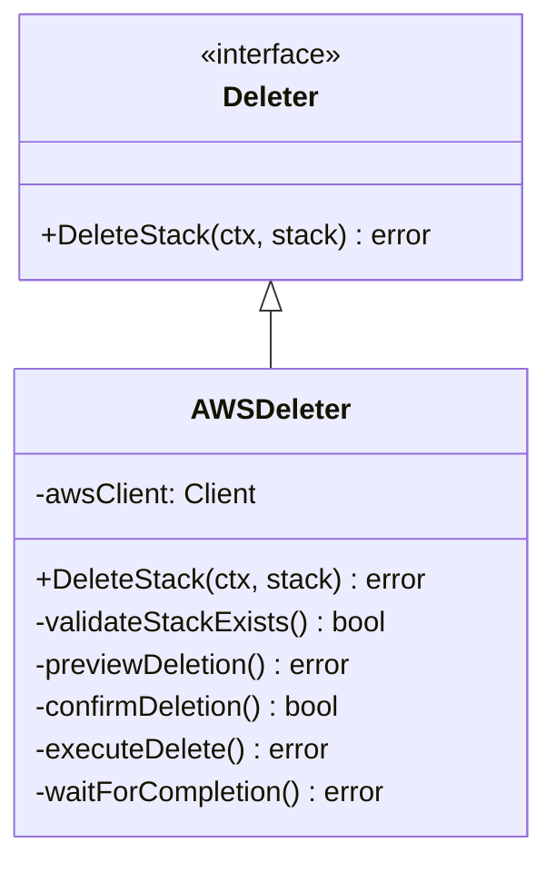

**Key Responsibilities:**
- Stack existence validation
- Deletion preview generation
- User confirmation handling
- AWS deletion execution
- Operation monitoring and feedback

#### 2.2 Safety and Confirmation Flow

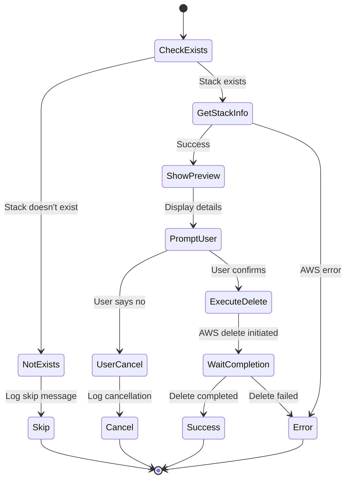

### 3. Safety Features

#### 3.1 Stack Preview

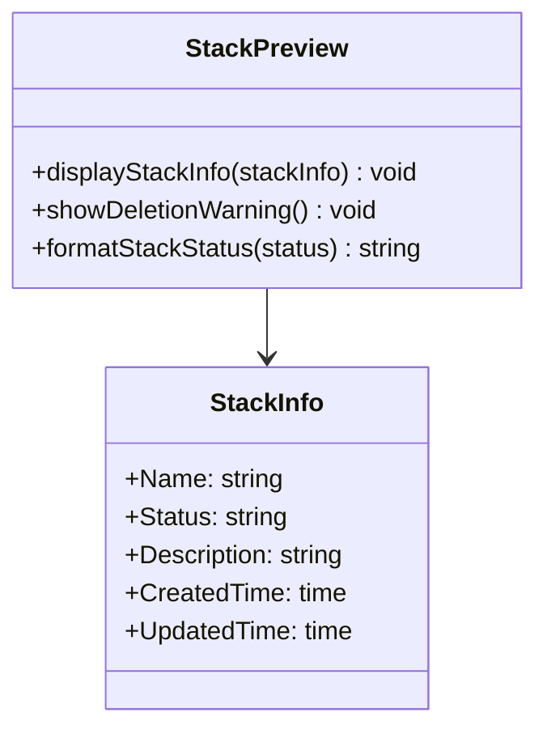

**Preview Components:**
- Stack name and context
- Current stack status
- Stack description
- Destructive operation warnings
- Cannot-be-undone disclaimers

#### 3.2 User Confirmation Integration

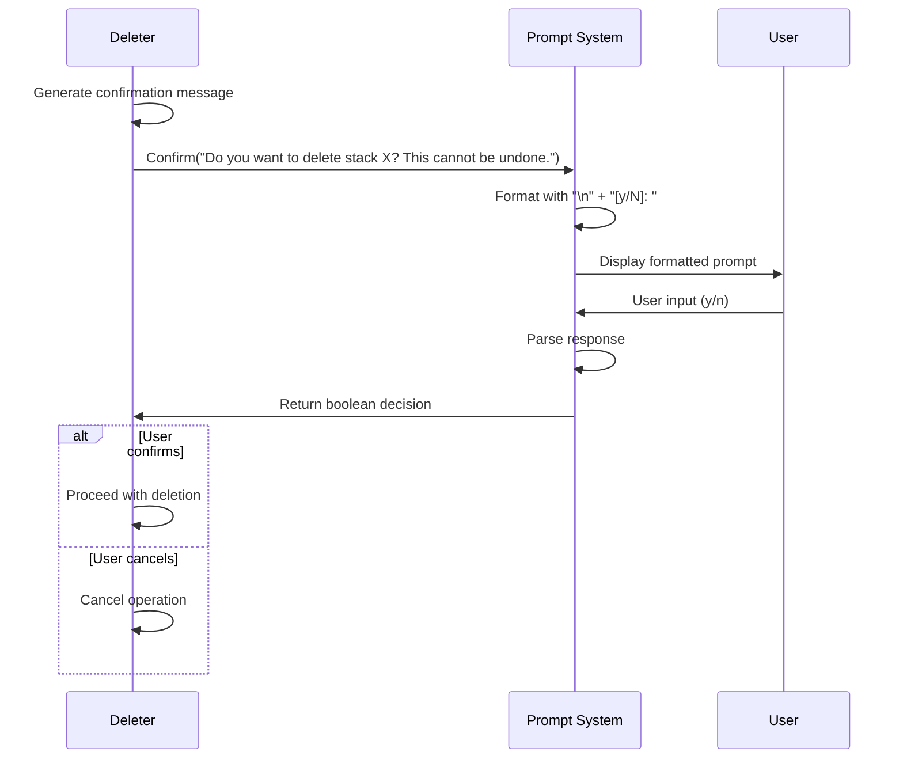

## Data Flow Architecture

### Single Stack Deletion Flow

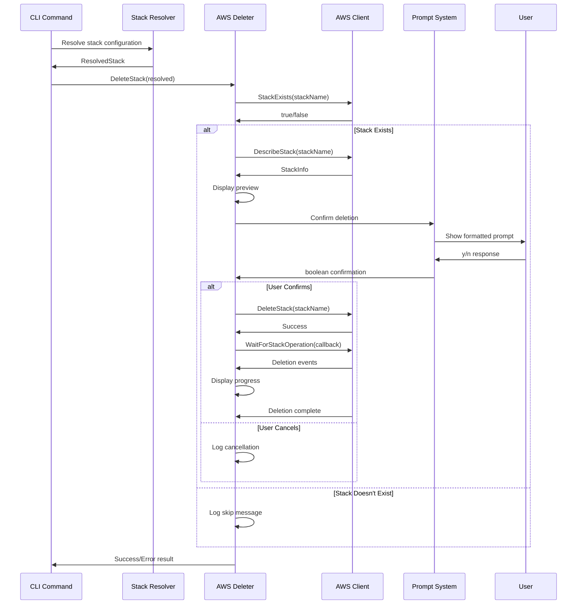

### Multiple Stack Deletion Flow

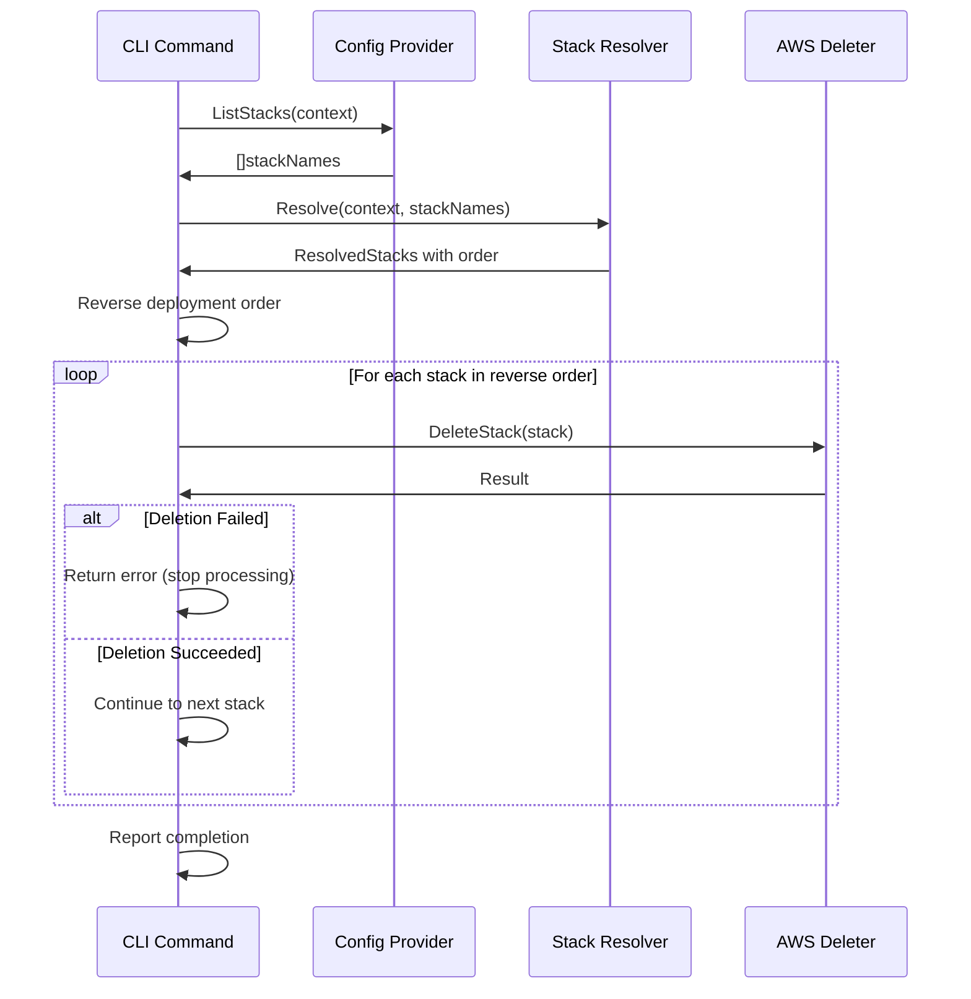

## Integration Points

### 1. AWS Integration (`internal/aws`)

**Required CloudFormation Operations:**
- `StackExists(stackName)` - Validate stack existence
- `DescribeStack(stackName)` - Get detailed stack information
- `DeleteStack(input)` - Execute stack deletion
- `WaitForStackOperation(name, callback)` - Monitor deletion progress
- `DescribeStackEvents(stackName)` - Retrieve deletion events

**AWS Permissions Required:**
```json
{
    "Version": "2012-10-17",
    "Statement": [
        {
            "Effect": "Allow",
            "Action": [
                "cloudformation:DescribeStacks",
                "cloudformation:DeleteStack",
                "cloudformation:DescribeStackEvents"
            ],
            "Resource": "*"
        }
    ]
}
```

### 2. Prompt System Integration (`internal/prompt`)

**Clean Separation of Concerns:**
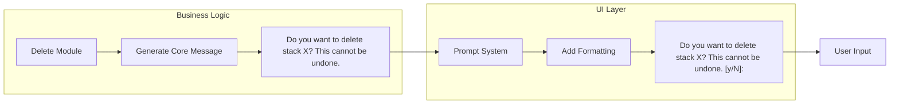

**Benefits:**
- Delete module focuses on business logic and safety
- Prompt system handles UI formatting consistently
- No technical prompt details leak into deletion logic

### 3. Configuration Integration (`internal/config`)

**Dependencies:**
- `ConfigProvider.ListStacks(context)` - Get all stacks in context
- `ConfigProvider.GetStack(name, context)` - Retrieve specific stack config
- Context validation and error handling

### 4. Stack Resolution (`internal/resolve`)

**Dependency Management:**
- `StackResolver.Resolve(ctx, context, stackNames)` - Full dependency resolution
- `ResolvedStacks.DeploymentOrder` - Ordered list for reversal
- Complete dependency graph for safe deletion ordering

## Error Handling Strategy

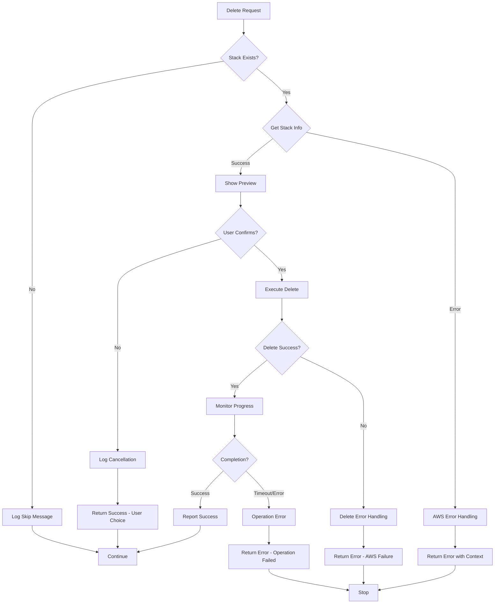

**Error Categories:**
1. **Configuration Errors** - Invalid contexts, missing stacks
2. **AWS Errors** - Permissions, API failures, stack states
3. **User Cancellation** - Treated as successful completion
4. **Operation Errors** - Deletion timeouts, dependency violations

**Error Context Enhancement:**
```go
// Examples of contextual error wrapping
fmt.Errorf("failed to check if stack exists: %w", err)
fmt.Errorf("failed to delete stack %s: %w", stackName, err)
fmt.Errorf("stack deletion failed or timed out: %w", err)
```

## Safety Architecture

### 1. Multi-Layer Safety System

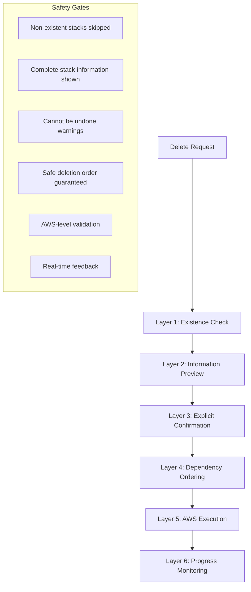

### 2. Confirmation Message Design

**Business Logic (Domain-Specific):**
```go
message := fmt.Sprintf("Do you want to delete stack %s? This cannot be undone.", stack.Name)
```

**UI Layer (Technical Details):**
```go
formattedMessage := fmt.Sprintf("\n%s [y/N]: ", message)
```

**Key Safety Features:**
- Default to "No" (`[y/N]`)
- Explicit "cannot be undone" warning
- Clear stack identification
- Consistent formatting across all prompts

### 3. Dependency Safety

**Reverse Order Algorithm:**
```go
// Safe deletion order calculation
deletionOrder := make([]string, len(resolved.DeploymentOrder))
for i, stackName := range resolved.DeploymentOrder {
    deletionOrder[len(resolved.DeploymentOrder)-1-i] = stackName
}
```

**Benefits:**
- Prevents AWS dependency violations
- Reduces likelihood of partial failures
- Maintains referential integrity
- Follows CloudFormation best practices

## Testing Architecture

### Test Categories

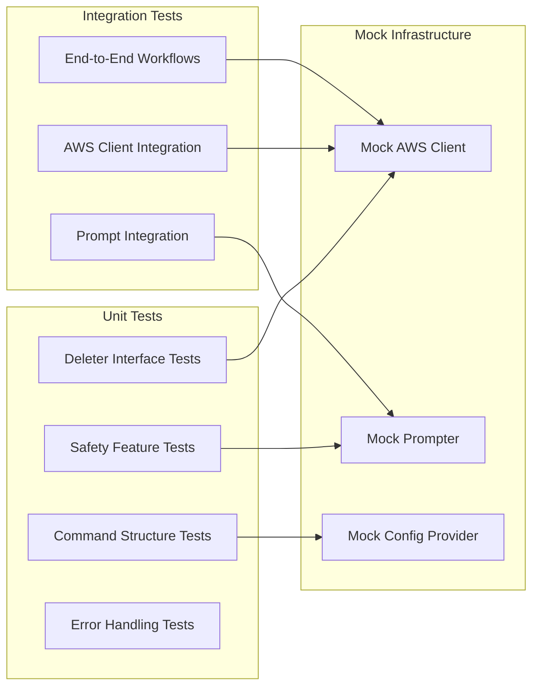

**Comprehensive Test Scenarios:**

1. **Success Paths:**
   - Single stack deletion with confirmation
   - Multiple stack deletion in correct order
   - Non-existent stack handling

2. **Safety Tests:**
   - User cancellation handling
   - Confirmation prompt integration
   - Preview information display

3. **Error Scenarios:**
   - AWS client failures
   - Stack existence check errors
   - Deletion operation failures
   - Timeout handling

4. **Edge Cases:**
   - Empty contexts
   - Invalid stack names
   - Circular dependencies
   - Concurrent deletions

### Mock Implementation Examples

```go
// Mock AWS operations for safe testing
mockCfnOps.On("StackExists", ctx, "test-stack").Return(true, nil)
mockCfnOps.On("DescribeStack", ctx, "test-stack").Return(stackInfo, nil)
mockPrompter.On("Confirm", "Do you want to delete stack test-stack? This cannot be undone.").Return(true, nil)
mockCfnOps.On("DeleteStack", ctx, deleteInput).Return(nil)
```

## Security Considerations

### 1. Authentication and Authorization

**AWS Credential Chain:**
- Uses AWS SDK v2 default credential provider chain
- Supports AWS profiles, environment variables, IAM roles
- Respects AWS region configuration

**Required IAM Permissions:**
```json
{
    "Version": "2012-10-17",
    "Statement": [
        {
            "Effect": "Allow",
            "Action": [
                "cloudformation:DescribeStacks",
                "cloudformation:DescribeStackEvents",
                "cloudformation:DeleteStack"
            ],
            "Resource": [
                "arn:aws:cloudformation:*:*:stack/*"
            ]
        }
    ]
}
```

### 2. Operational Security

**Audit Trail:**
- All deletion attempts logged with context
- User confirmation decisions recorded
- Stack state changes tracked
- Error conditions documented

**Fail-Safe Mechanisms:**
- Default denial on unclear user input
- Explicit confirmation required for each stack
- No bulk deletion without individual confirmation
- Operation halts on first failure in multi-stack deletion

### 3. Data Protection

**Information Handling:**
- Stack names and contexts logged safely
- No sensitive parameter values in logs
- Error messages sanitised to prevent information leakage
- AWS API responses handled securely

## Performance Considerations

### Optimisation Strategies

1. **Sequential Deletion** - Ensures dependency safety over speed
2. **Early Termination** - Stops processing on first error
3. **Efficient Existence Checks** - Quick validation before expensive operations
4. **Event Streaming** - Real-time progress feedback

### Resource Management

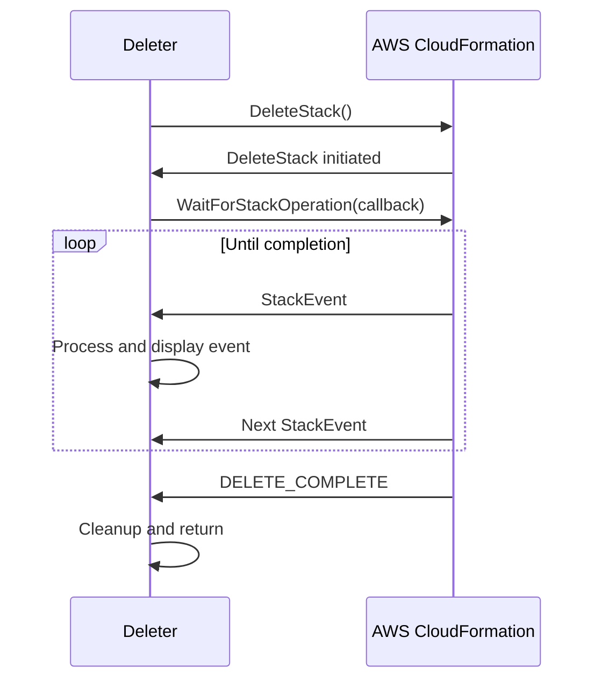

**Monitoring Benefits:**
- Real-time user feedback
- Early error detection
- Resource cleanup tracking
- Progress visibility

## Future Enhancements

### Phase 2 Considerations

1. **Advanced Safety Features**
   - Dry-run mode with preview-only operations
   - Force flag for automation scenarios
   - Batch confirmation for multiple stacks
   - Rollback protection for critical resources

2. **Enhanced User Experience**
   - Interactive stack selection
   - Deletion impact analysis
   - Resource inventory before deletion
   - Confirmation timeouts

3. **Operational Features**
   - Deletion scheduling
   - Notification integration
   - Audit log exports
   - Multi-region support

4. **Integration Enhancements**
   - CI/CD pipeline integration
   - External approval workflows
   - Resource retention policies
   - Cost impact analysis

### Extension Points

The architecture provides clear extension points:
- `Deleter` interface - Alternative deletion strategies
- Confirmation system - Custom approval workflows
- Progress monitoring - Enhanced feedback mechanisms
- Safety validations - Additional pre-deletion checks

### Architectural Principles for Extensions

1. **Safety First** - All enhancements must maintain or improve safety
2. **User Confirmation** - Explicit approval required for destructive operations
3. **Dependency Awareness** - Respect CloudFormation dependency constraints
4. **Error Transparency** - Clear communication of failures and remediation
5. **Operational Visibility** - Comprehensive logging and monitoring

This modular, safety-focused design ensures that stack deletion operations are reliable, transparent, and reversible through proper planning, while maintaining the flexibility to evolve with operational requirements.