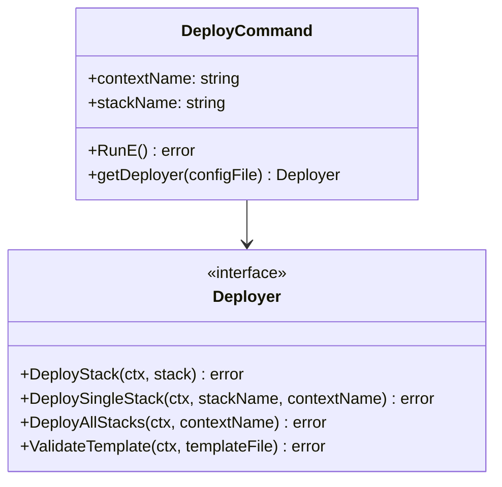
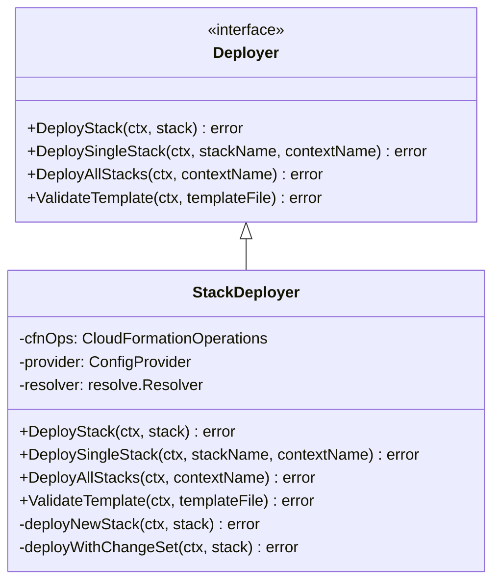
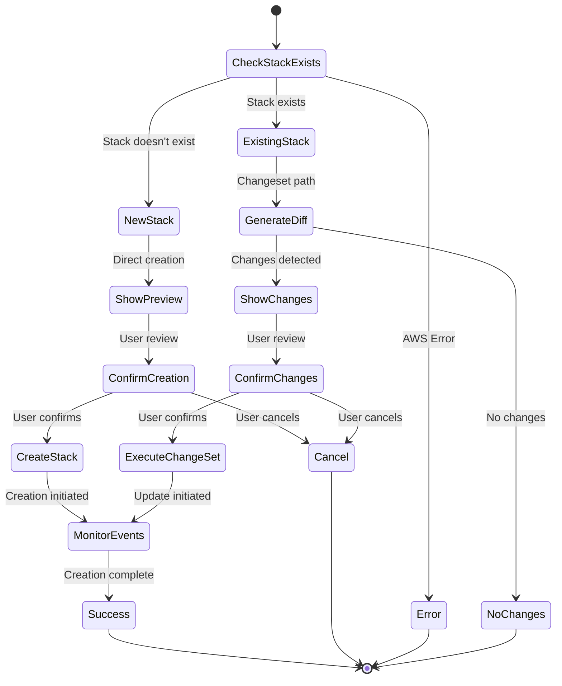
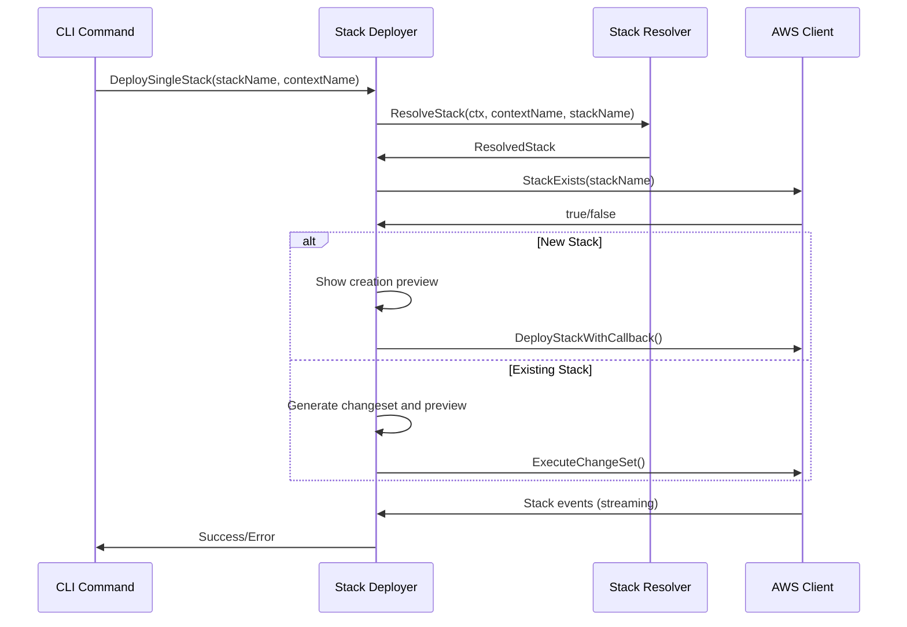
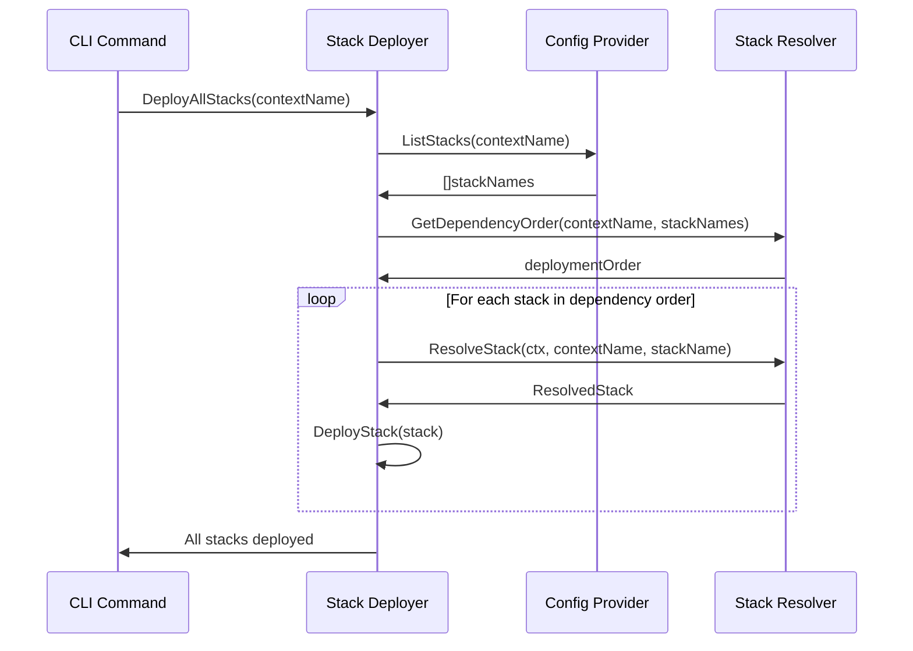
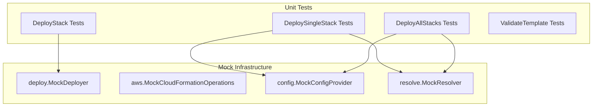

# Deploy Module Architecture

## Overview

The deploy module provides CloudFormation stack deployment capabilities with integrated change preview, user confirmation workflows, and progress tracking. It supports both new stack creation and existing stack updates through changesets, ensuring safe and predictable deployments.

## Architecture Diagram

```mermaid
graph TB
    subgraph "Command Layer"
        CLI[deploy command<br/>cmd/deploy.go]
    end

    subgraph "Core Deploy Module"
        DI[Deployer Interface<br/>deployer.go]
        SD[StackDeployer<br/>deployer.go]

        subgraph "Business Methods"
            DS[DeployStack<br/>single stack deployment]
            DSS[DeploySingleStack<br/>with resolution]
            DAS[DeployAllStacks<br/>with dependency ordering]
            VT[ValidateTemplate<br/>template validation]
        end

        subgraph "Deployment Strategies"
            NS[New Stack Creation<br/>deployNewStack()]
            CS[Changeset Deployment<br/>deployWithChangeSet()]
        end
    end

    subgraph "External Dependencies"
        AWS[AWS CloudFormation<br/>internal/aws]
        DIFF[Diff Engine<br/>internal/diff]
        PROMPT[User Prompt<br/>internal/prompt]
        CFG[Configuration<br/>internal/config]
        RES[Stack Resolver<br/>internal/resolve]
    end

    CLI --> DI
    CLI --> CFG
    CLI --> RES
    DI <|-- SD
    SD --> DS
    SD --> DSS
    SD --> DAS
    SD --> VT
    SD --> NS
    SD --> CS

    SD --> AWS
    CS --> DIFF
    SD --> PROMPT
    SD --> CFG
    SD --> RES
```

## Component Architecture

### Command Layer (`cmd/deploy.go`)

**Responsibility:** CLI interface and dependency injection setup



**Key Features:**
- Single and multiple stack deployment support
- Dependency injection setup - creates ConfigProvider, StackResolver, and injects into StackDeployer
- Command-level routing based on argument count
- Template validation capabilities
- Error handling with proper exit codes

### Core Deploy Engine (`internal/deploy/`)



**Key Responsibilities:**
- **DeployStack**: Core deployment with strategy selection (new stack vs changeset)
- **DeploySingleStack**: Single stack deployment with resolution
- **DeployAllStacks**: Multiple stack deployment with dependency-aware ordering
- **Template Validation**: CloudFormation template syntax and structure validation
- **Strategy Selection**: Automatically chooses deployment approach based on stack existence
- **Progress Monitoring**: Real-time feedback during deployment operations

### Deployment Strategy Selection



## Data Flow

### Single Stack Deployment



### Multiple Stack Deployment



## Integration Points

### AWS Integration (`internal/aws`)
- `StackExists()` - Pre-deployment validation
- `DeployStackWithCallback()` - New stack creation with progress streaming
- `ExecuteChangeSet()` - Update execution for existing stacks
- `WaitForStackOperation()` - Progress monitoring with event callbacks
- `ValidateTemplate()` - Template syntax validation

### Diff Engine Integration (`internal/diff`)
- Uses `StackDiffer` for change preview
- `KeepChangeSet: true` option preserves changesets for deployment
- Consistent formatting between preview and deployment
- Automatic changeset lifecycle management

### User Prompt Integration (`internal/prompt`)
- Consistent confirmation messages across deployment types
- Clear indication of operations to be performed
- Graceful cancellation handling with resource cleanup

## Error Handling

**Error Categories:**

1. **Pre-deployment Errors**
   - AWS connectivity issues
   - Template validation failures
   - Stack name conflicts

2. **Changeset Errors**
   - Changeset creation failures
   - Invalid template changes
   - Resource conflicts

3. **Deployment Errors**
   - Resource creation/update failures
   - Timeout during operations
   - Service limits exceeded

4. **User Interaction Errors**
   - Interrupted deployments
   - Invalid input handling

## Testing Architecture

### Test Structure



**Key Test Patterns:**

1. **Interface-based Testing**: All dependencies mocked through interfaces
2. **Mock Consolidation**: Shared mock implementations from `*/testing.go` files
3. **Comprehensive Coverage**: Success paths, error scenarios, and edge cases
4. **Dependency Injection**: Easy mock injection for isolated testing

## Security Considerations

### AWS Permissions
Required CloudFormation permissions:
- `cloudformation:CreateStack`
- `cloudformation:UpdateStack`
- `cloudformation:DescribeStacks`
- `cloudformation:CreateChangeSet`
- `cloudformation:ExecuteChangeSet`
- `cloudformation:ValidateTemplate`

### Operational Security
- Always requires explicit user confirmation unless auto-approved
- Clear indication of operations to be performed
- Changeset cleanup to prevent resource accumulation
- No sensitive data logging in deployment output
- Secure parameter handling (supports NoEcho parameters)

## Performance Considerations

### Optimisation Strategies
- Connection pooling for AWS clients
- Memory-efficient event streaming
- Immediate changeset cleanup after deployment
- Concurrent template validation during resolution

### Progress Monitoring
- Buffered event processing to prevent UI flooding
- Relevant event filtering (skip redundant status updates)
- Structured logging for debugging without performance impact
