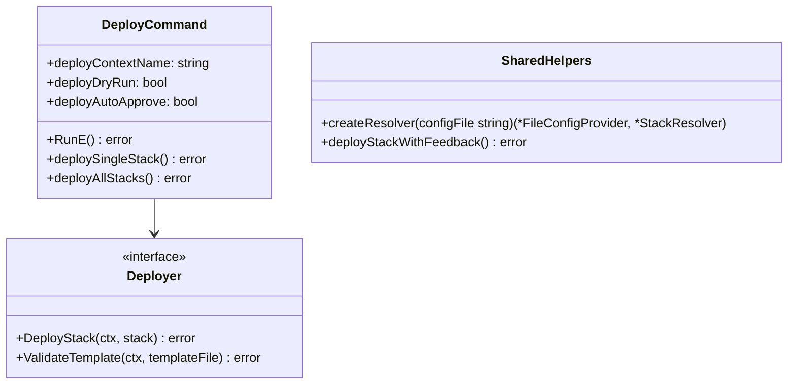
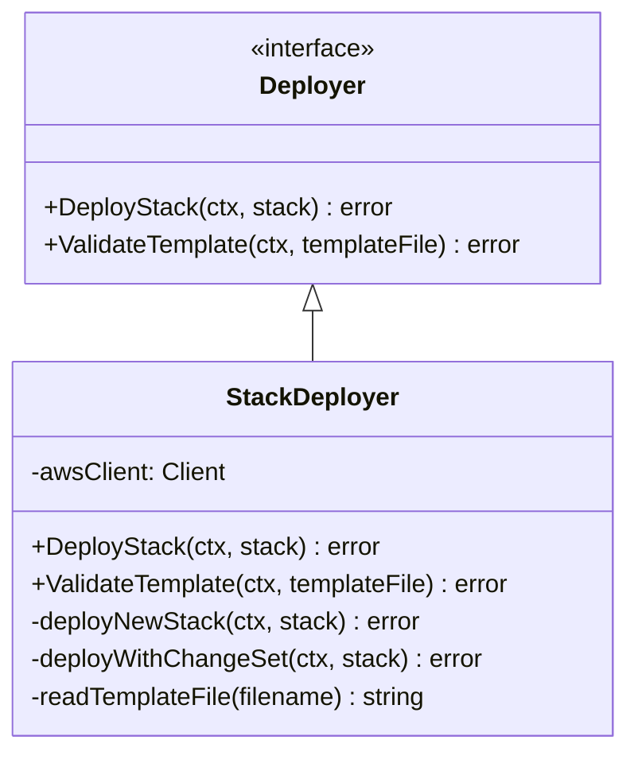
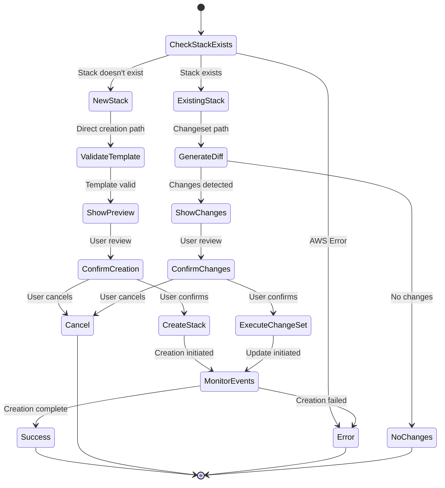
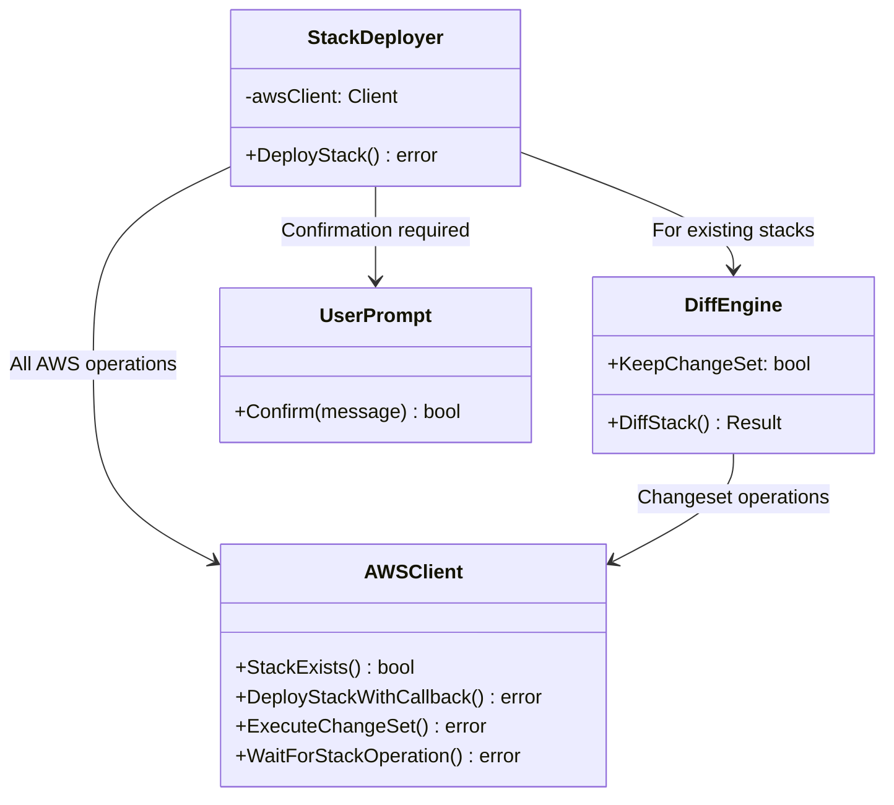
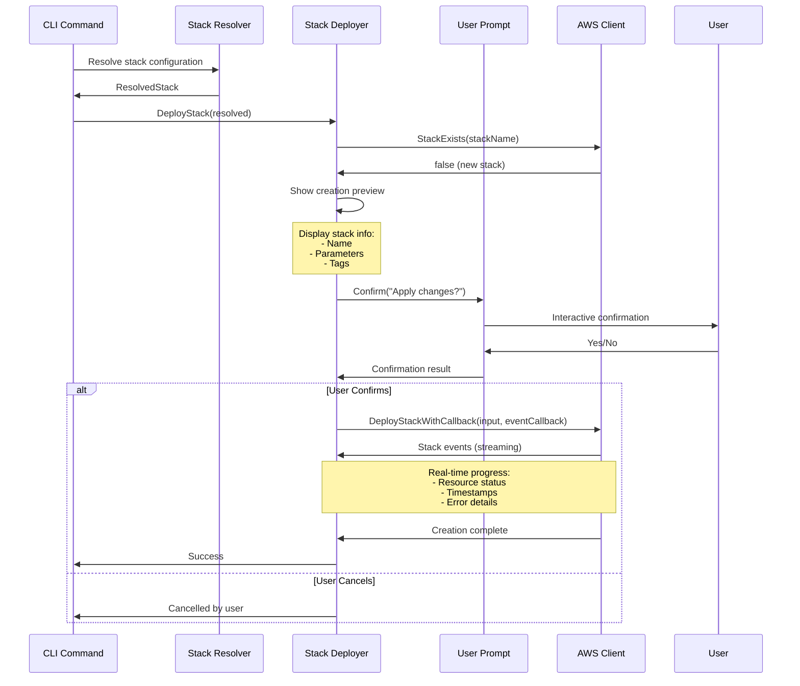
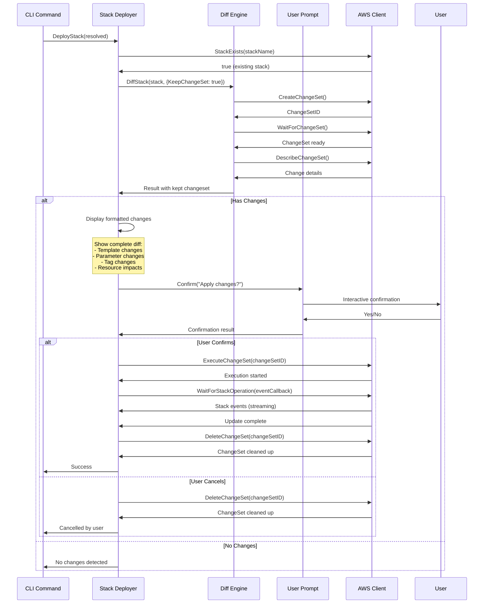
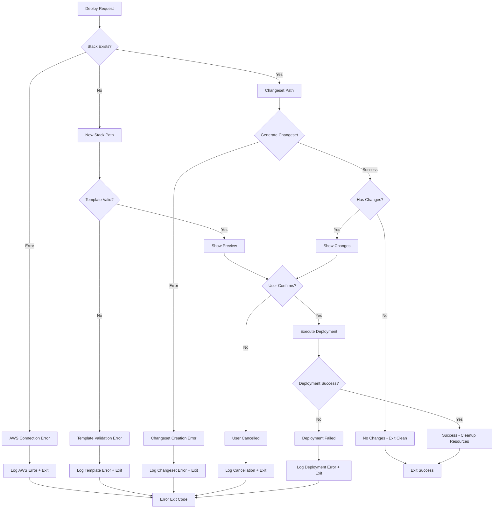
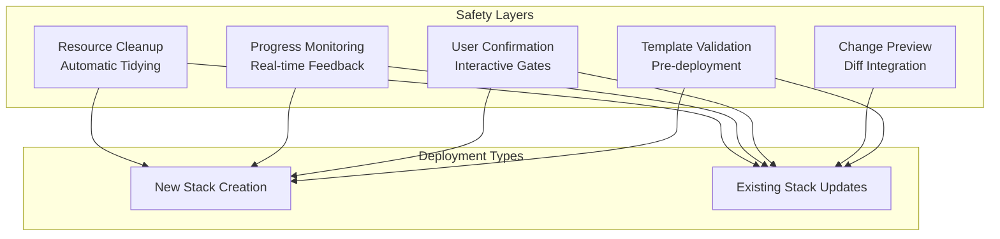
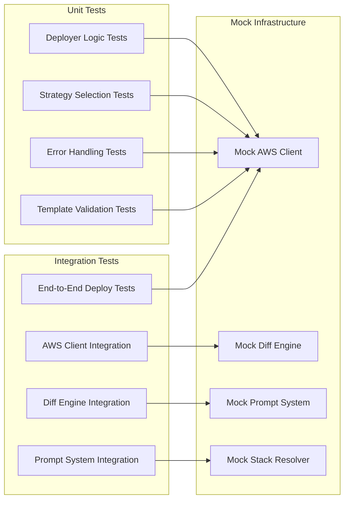
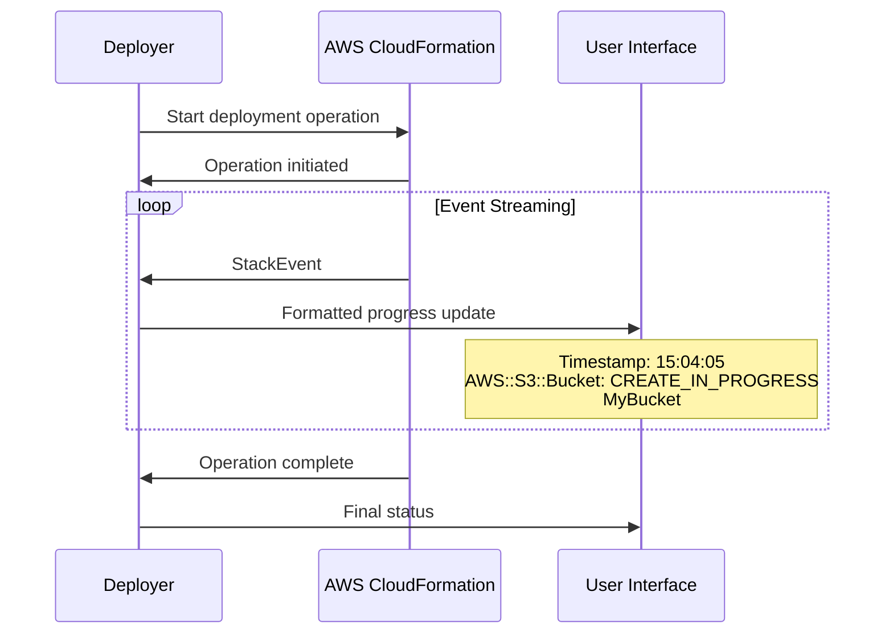

# Deploy Module Architecture

## Overview

The deploy module provides comprehensive CloudFormation stack deployment capabilities with integrated change preview, user confirmation workflows, and progress tracking. It supports both new stack creation and existing stack updates through changesets, ensuring safe and predictable deployments with full visibility into changes before execution.

## Architecture Diagram

```mermaid
graph TB
    subgraph "Command Layer"
        CLI[deploy command<br/>cmd/deploy.go]
    end

    subgraph "Core Deploy Module"
        DI[Deployer Interface<br/>deployer.go]
        SD[StackDeployer<br/>deployer.go]

        subgraph "Deployment Strategies"
            NS[New Stack Creation<br/>deployNewStack()]
            CS[Changeset Deployment<br/>deployWithChangeSet()]
        end

        subgraph "Validation"
            TV[Template Validator<br/>ValidateTemplate()]
        end
    end

    subgraph "External Dependencies"
        AWS[AWS CloudFormation<br/>internal/aws]
        DIFF[Diff Engine<br/>internal/diff]
        PROMPT[User Prompt<br/>internal/prompt]
        CFG[Configuration<br/>internal/config]
        RES[Stack Resolver<br/>internal/resolve]
    end

    CLI --> DI
    DI --> SD
    SD --> NS
    SD --> CS
    SD --> TV

    SD --> AWS
    CS --> DIFF
    SD --> PROMPT
    CLI --> CFG
    CLI --> RES

    DIFF --> AWS
```

## Component Architecture

### 1. Command Layer (`cmd/deploy.go`)

**Responsibility:** CLI interface and deployment orchestration



**Key Features:**
- Context-based deployment targeting
- Command-level routing between single and multiple stack operations
- Dry-run mode for safe testing
- Auto-approve option for CI/CD pipelines
- Multi-stack deployment coordination with dependency ordering
- Shared infrastructure for common operations
- Error aggregation and reporting

### 2. Core Deploy Engine (`internal/deploy/`)

#### 2.1 Deployer Interface and Implementation



**Key Responsibilities:**
- Deployment strategy selection based on stack existence
- Template validation and parameter handling
- AWS CloudFormation operation orchestration
- Progress monitoring and user feedback
- Error handling and rollback coordination

#### 2.2 Deployment Strategy Selection



### 3. Command Architecture Pattern

**Function Separation:**
- `deploySingleStack()` - Handles single stack deployment using `ResolveStack()`
- `deployAllStacks()` - Handles multiple stack deployment using `GetDependencyOrder()` with dependency ordering
- Command routing logic at action level based on argument count

**Shared Infrastructure (`cmd/helpers.go`):**
- `createResolver(configFile string)` - Common configuration provider and stack resolver creation
- `deployStackWithFeedback()` - Consistent deployment execution with error handling and user feedback
- Eliminates code duplication between single and multiple stack operations

**Architecture Benefits:**
- Clear separation of concerns between single vs multiple stack scenarios
- Consistent error handling and user messaging
- Shared infrastructure reduces maintenance overhead
- Command-level routing provides clear control flow

### 4. Integration Architecture



## Data Flow Architecture

### New Stack Deployment Flow



### Existing Stack Update Flow



## Integration Points

### 1. AWS Integration (`internal/aws`)

**Core Operations:**
- `StackExists()` - Pre-deployment validation
- `DescribeStack()` - Current stack information retrieval
- `DeployStackWithCallback()` - New stack creation with progress streaming
- `ExecuteChangeSet()` - Update execution for existing stacks
- `WaitForStackOperation()` - Progress monitoring with event callbacks
- `ValidateTemplate()` - Template syntax validation
- `DeleteChangeSet()` - Resource cleanup

**Extended Capabilities:**
```go
type DeployStackInput struct {
    StackName    string
    TemplateBody string
    Parameters   []Parameter
    Tags         map[string]string
    Capabilities []string
}

type StackEvent struct {
    Timestamp            time.Time
    ResourceStatus       string
    ResourceType         string
    LogicalResourceId    string
    ResourceStatusReason string
}
```

### 2. Diff Engine Integration (`internal/diff`)

**Enhanced Integration for Change Preview:**

**Integrated Preview System:**
- Uses same `StackDiffer` as standalone diff command
- Simplified `diff.Options` structure (text-only output)
- `KeepChangeSet: true` option preserves changesets for deployment
- Consistent formatting between preview and standalone diff
- Automatic changeset lifecycle management

**Deployment Integration Pattern:**
```go
diffOptions := diff.Options{
    Format:        "text",
    KeepChangeSet: true, // Critical for deployment use
}
diffResult, err := differ.DiffStack(ctx, stack, diffOptions)
if diffResult.ChangeSet != nil {
    // Use changeset for deployment
    err = cfnOps.ExecuteChangeSet(ctx, diffResult.ChangeSet.ChangeSetID)
}
```

### 3. User Prompt Integration (`internal/prompt`)

**Confirmation Workflow:**
- Consistent confirmation messages across deployment types
- Clear indication of irreversible operations
- Support for auto-approve mode in CI/CD environments
- Graceful cancellation handling with resource cleanup

### 4. Configuration Integration (`internal/config`)

**Stack Resolution Dependencies:**
- Template path resolution and content loading
- Parameter inheritance and context-specific overrides
- Capability configuration for IAM resource creation
- Tag application from configuration hierarchy

### 5. Multi-Stack Coordination

**Dependency-Aware Deployment:**
- Integration with `internal/resolve` for dependency ordering
- Sequential deployment with failure isolation
- Progress tracking across multiple stacks
- Rollback coordination for failed deployments

## Error Handling Strategy



**Error Categories:**

1. **Pre-deployment Errors**
   - AWS connectivity issues
   - Template validation failures
   - Permission/credential problems
   - Stack name conflicts

2. **Changeset Errors**
   - Changeset creation failures
   - Invalid template changes
   - Resource limit violations
   - Dependency conflicts

3. **Deployment Errors**
   - Resource creation/update failures
   - Timeout during operations
   - Rollback scenarios
   - Service limit exceeded

4. **User Interaction Errors**
   - Prompt system failures
   - Interrupted deployments
   - Invalid input handling

## Safety Architecture

### 1. Multi-Layer Safety System



### 2. Change Preview Integration

**Consistent Preview System:**
- Same diff engine as `stackaroo diff` command
- Template, parameter, and tag change analysis
- AWS changeset preview for resource-level changes
- Resource replacement impact assessment
- Cost estimation context (when available)

### 3. Confirmation Message Design

```text
New Stack Creation:
===================
This will create a new CloudFormation stack with:
- Name: my-app-prod
- Parameters: 5
- Tags: 3

Do you want to apply these changes to stack my-app-prod?

Existing Stack Updates:
======================
Changes to be applied to stack my-app-prod:

Template Changes:
-----------------
✓ Template has been modified
Resource changes:
  + 2 resources to be added
  ~ 1 resources to be modified

Parameter Changes:
------------------
  + NewParam: value123
  ~ ExistingParam: oldvalue → newvalue

AWS CloudFormation Preview:
---------------------------
Resource Changes:
  + MyBucket (AWS::S3::Bucket)
  ~ MyRole (AWS::IAM::Role) - Replacement: False

Do you want to apply these changes to stack my-app-prod?
```

## Testing Architecture

### Test Categories



**Test Coverage Areas:**

1. **Deployment Strategy Selection**
   - New stack detection and handling
   - Existing stack update flow
   - Error scenario handling

2. **Integration Testing**
   - AWS client mock interactions
   - Diff engine integration
   - User confirmation workflows
   - Event streaming and progress tracking

3. **Error Scenario Testing**
   - Template validation failures
   - AWS service errors
   - User cancellation handling
   - Resource cleanup verification

4. **Mock Implementation Examples**
```go
type MockAWSClient struct {
    StackExistsFunc func(ctx context.Context, name string) (bool, error)
    DeployStackFunc func(ctx context.Context, input DeployStackInput, callback func(StackEvent)) error
    ExecuteChangeSetFunc func(ctx context.Context, changeSetID string) error
}

type MockDiffer struct {
    DiffStackFunc func(ctx context.Context, stack *model.Stack, options Options) (*Result, error)
}

type MockPrompt struct {
    ConfirmFunc func(message string) (bool, error)
}
```

## Performance Considerations

### Optimisation Strategies

1. **Concurrent Operations**
   - Parallel template validation during resolution
   - Concurrent changeset generation for multiple stacks
   - Asynchronous event streaming

2. **Resource Management**
   - Immediate changeset cleanup after deployment
   - Connection pooling for AWS clients
   - Memory-efficient event streaming

3. **Caching Optimisations**
   - Template content caching for repeated deployments
   - Stack information caching for dependency resolution
   - Credential caching across stack operations

### Progress Monitoring Efficiency



**Event Processing Optimisations:**
- Buffered event processing to prevent UI flooding
- Relevant event filtering (skip redundant status updates)
- Structured logging for debugging without impacting performance

## Security Considerations

### 1. Credential and Permission Management

**AWS Credential Handling:**
- Uses AWS SDK default credential chain
- Supports role assumption for cross-account deployments
- Respects AWS profile configuration
- No credential storage or logging

**Required Permissions:**
```json
{
  "Version": "2012-10-17",
  "Statement": [
    {
      "Effect": "Allow",
      "Action": [
        "cloudformation:CreateStack",
        "cloudformation:UpdateStack",
        "cloudformation:DescribeStacks",
        "cloudformation:DescribeStackEvents",
        "cloudformation:GetTemplate",
        "cloudformation:CreateChangeSet",
        "cloudformation:DescribeChangeSet",
        "cloudformation:ExecuteChangeSet",
        "cloudformation:DeleteChangeSet",
        "cloudformation:ValidateTemplate"
      ],
      "Resource": "*"
    }
  ]
}
```

### 2. Template and Data Security

**Template Handling:**
- Template content validation before deployment
- No sensitive data logging in error messages
- Secure parameter passing (supports NoEcho parameters)
- Template content is not cached persistently

**Parameter Security:**
- Supports CloudFormation NoEcho parameters
- No parameter values logged in deployment output
- Secure handling of sensitive configuration data

### 3. Operational Security

**Deployment Safety:**
- Always requires explicit user confirmation unless auto-approved
- Clear indication of destructive operations
- Changeset cleanup to prevent resource accumulation
- Operation logging for audit trails

**Error Information:**
- Sanitised error messages to avoid data exposure
- Detailed logging available via debug flags
- AWS request IDs included for troubleshooting

## Future Enhancements

### Phase 2 Considerations

1. **Advanced Deployment Strategies**
   - Blue/green deployment support
   - Rolling update strategies for multiple environments
   - Canary deployment integration
   - Rollback automation based on health checks

2. **Enhanced Progress Monitoring**
   - Real-time cost tracking during deployment
   - Resource dependency visualisation
   - Deployment timeline and bottleneck analysis
   - Integration with external monitoring systems

3. **CI/CD Pipeline Integration**
   - Webhook integration for deployment notifications
   - Artifact management for template versioning
   - Deployment approval workflows
   - Integration with external approval systems

### Extension Points

The architecture provides clear extension points through interfaces:

- `Deployer` interface - Alternative deployment engines
- Event callback system - Custom progress monitoring
- Confirmation system - Integration with external approval workflows
- Template validation - Custom validation rules and policies

### Architectural Principles for Extensions

1. **Separation of Concerns** - Deploy logic independent of AWS specifics
2. **Interface-Based Design** - All external dependencies behind interfaces
3. **Event-Driven Progress** - Pluggable progress monitoring and reporting
4. **Error Context Preservation** - Rich error information without data exposure
5. **Resource Lifecycle Management** - Automatic cleanup and resource management

This modular design ensures the deployment functionality can evolve to support complex enterprise requirements while maintaining simplicity for basic use cases.
