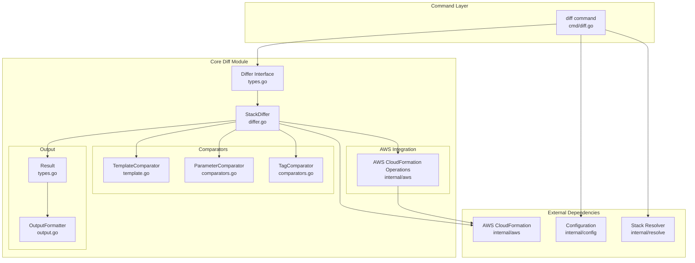
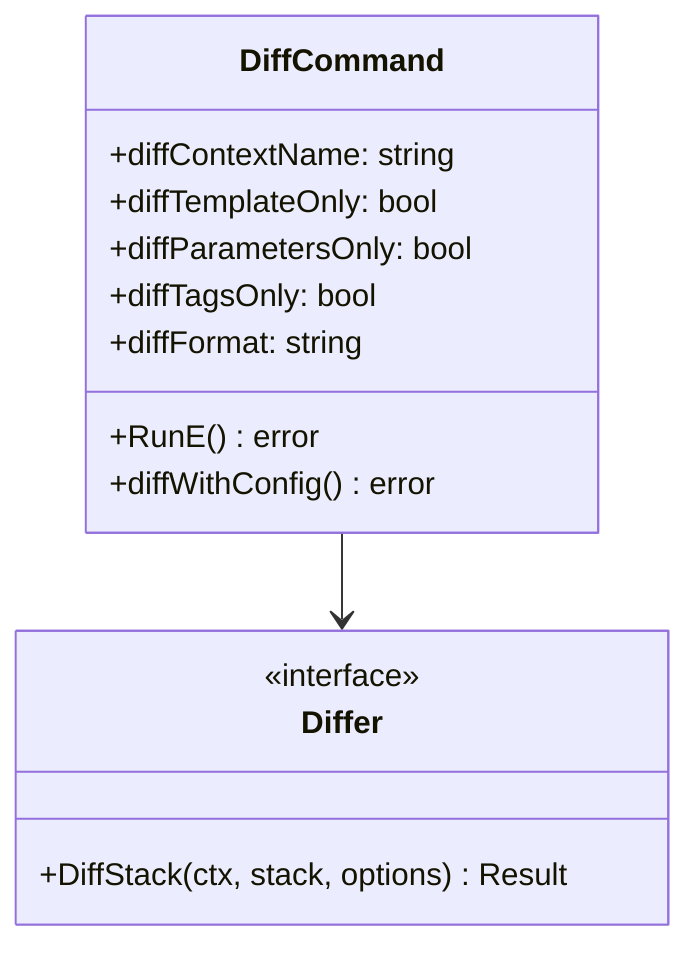
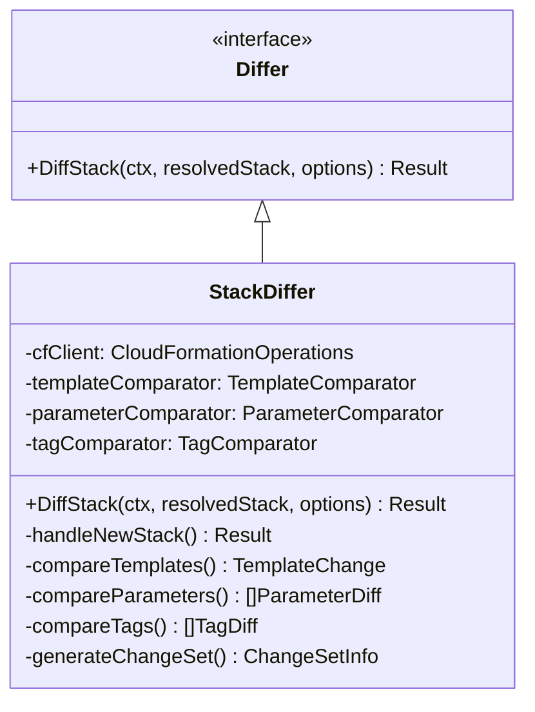
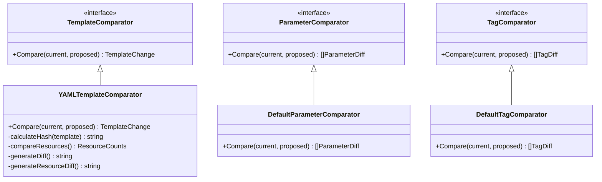
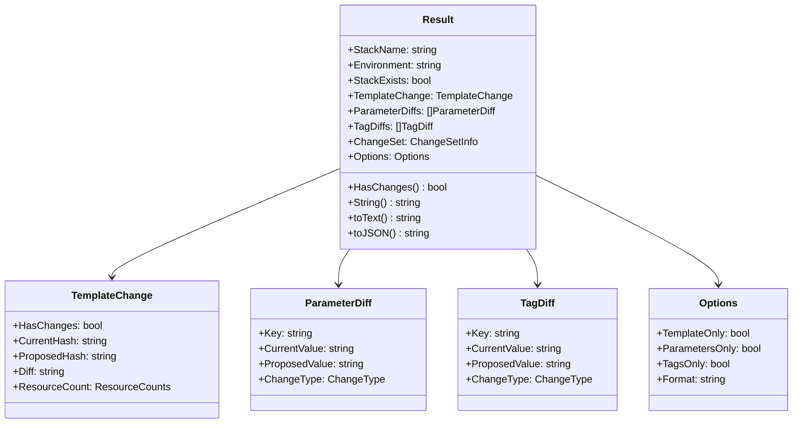
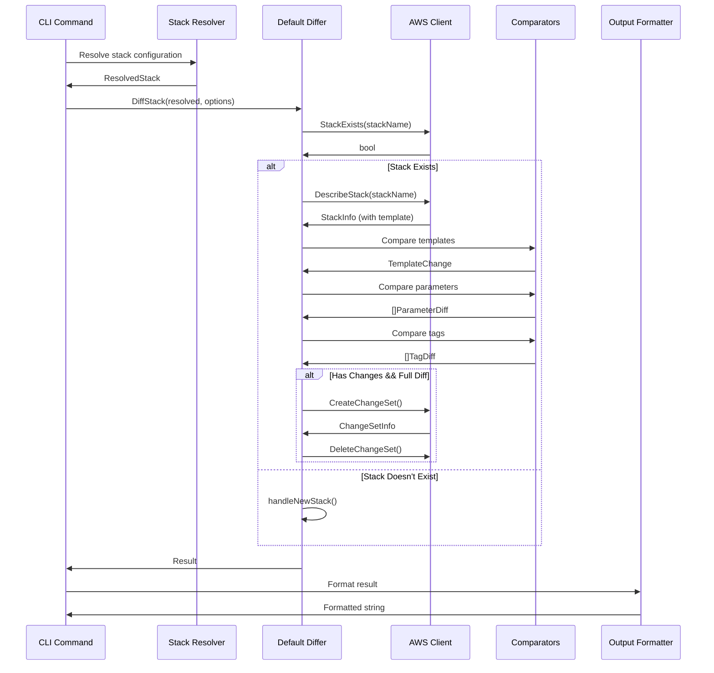
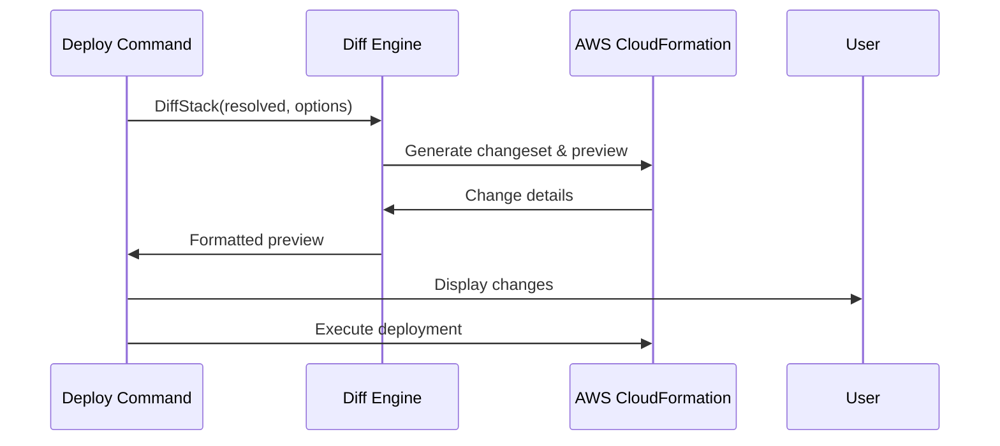
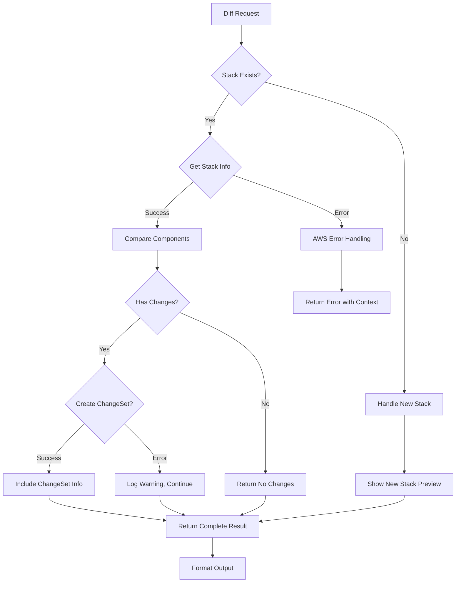
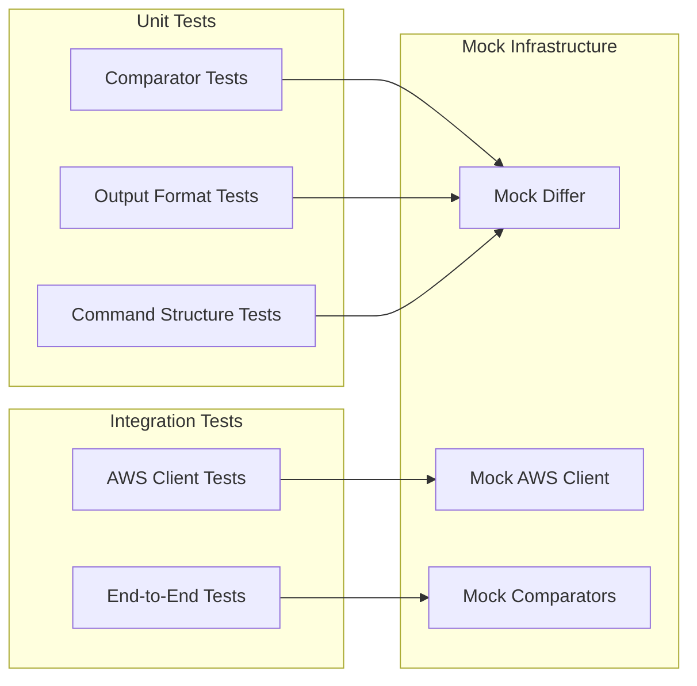
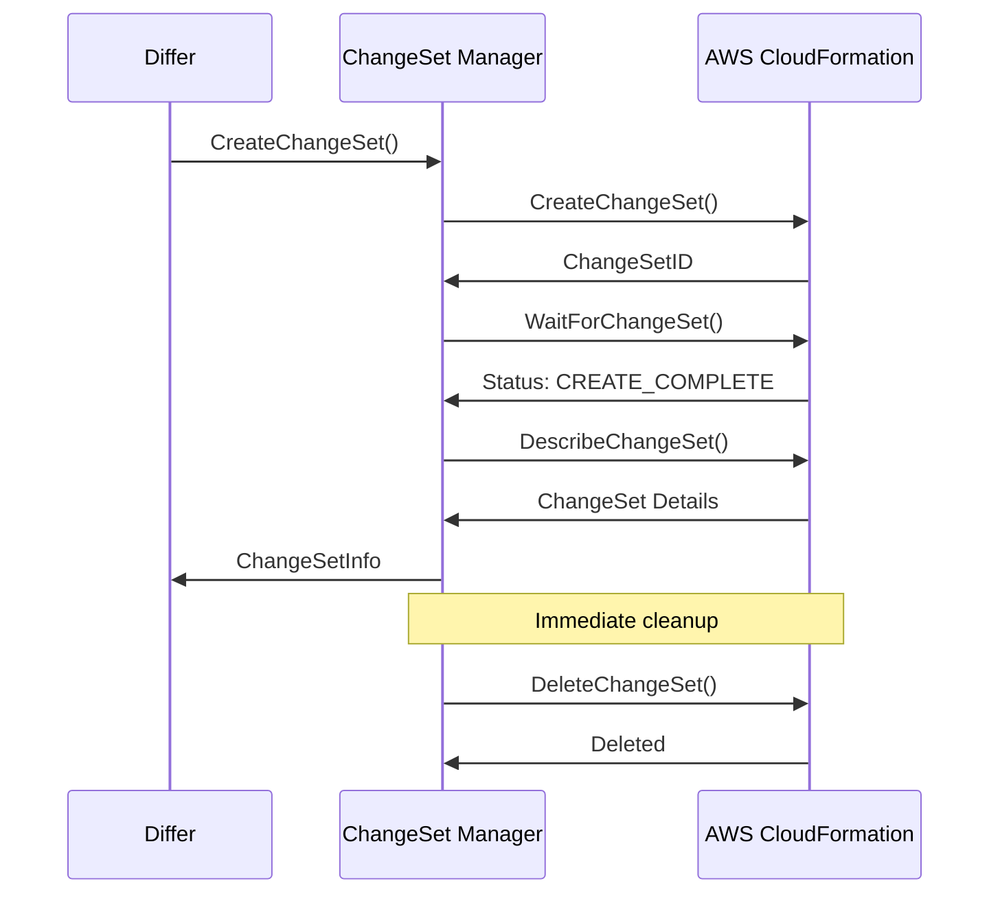

# Diff Module Architecture

## Overview

The diff module provides comprehensive comparison capabilities between deployed CloudFormation stacks and local configuration. It enables developers to preview changes before deployment, supporting template, parameter, and tag comparisons with multiple output formats.

## Architecture Diagram



## Component Architecture

### 1. Command Layer (`cmd/diff.go`)

**Responsibility:** CLI interface and user interaction



**Key Features:**
- Flag validation and parsing
- Configuration resolution integration
- Options mapping to diff service
- Error handling and exit codes

### 2. Core Diff Engine (`internal/diff/`)

#### 2.1 Differ Interface and Implementation



**Key Responsibilities:**
- Orchestrate comparison workflow
- Handle new vs. existing stack scenarios
- Integrate multiple comparison types
- Manage AWS changeset lifecycle

#### 2.2 Comparator Components



### 3. Data Models



## Data Flow Architecture



## Integration Points

### 1. AWS Integration (`internal/aws`)

**Extended Interfaces:**
- `StackExists()` - Check stack existence
- `DescribeStack()` - Get detailed stack information including template
- `GetTemplate()` - Retrieve deployed template content
- `CreateChangeSet()` - Generate change preview
- `DeleteChangeSet()` - Clean up temporary changesets
- `DescribeChangeSet()` - Get changeset details

### 2. Configuration Integration (`internal/config`)

**Dependencies:**
- `ConfigProvider` - Load environment-specific configuration
- Stack resolution and parameter inheritance
- Template path resolution

### 3. Stack Resolution (`internal/resolve`)

**Enhanced Integration:**
- `ResolvedStack.GetTemplateContent()` - Access resolved template
- `ResolvedStacks.Context` - Track deployment context
- Dependency resolution for complete stack information

### 4. Deployment Integration (`internal/deploy`)

**Integrated Preview:**
- `NewDiffer(cfClient)` - Create differ with existing CloudFormation operations
- `DiffStack(ctx, resolvedStack, options)` - Generate change preview during deployment
- Consistent formatting between `stackaroo diff` and `stackaroo deploy` commands
- Automatic change preview before deployment execution for existing stacks
- Same changeset-based approach for both standalone diff and integrated deployment preview

**Deployment Flow Integration:**


## Error Handling Strategy



**Error Categories:**
1. **Configuration Errors** - Invalid stack names, missing environments
2. **AWS Errors** - Credentials, permissions, API failures
3. **Template Errors** - Invalid YAML, parsing failures
4. **Changeset Errors** - Non-blocking warnings for preview failures

## Output Architecture

### Text Output Format
```
Stack: vpc (Environment: dev)
==================================================

Status: CHANGES DETECTED

Template Changes:
-----------------
✓ Template has been modified
Resource changes:
  + 2 resources to be added
  ~ 1 resources to be modified

Parameter Changes:
------------------
  + NewParam: value123
  ~ ExistingParam: oldvalue → newvalue
  - RemovedParam: oldvalue

Tag Changes:
------------
  + Environment: dev
  ~ Owner: oldteam → newteam

AWS CloudFormation Preview:
---------------------------
ChangeSet ID: arn:aws:cloudformation:...
Status: CREATE_COMPLETE

Resource Changes:
  + MyBucket (AWS::S3::Bucket)
  ~ MyRole (AWS::IAM::Role) - Replacement: False
    Property: PolicyDocument
```

### JSON Output Format
```json
{
  "stackName": "vpc",
  "environment": "dev",
  "stackExists": true,
  "hasChanges": true,
  "templateChanges": {
    "hasChanges": true,
    "resourceCount": {"added": 2, "modified": 1, "removed": 0}
  },
  "parameterDiffs": [
    {"key": "NewParam", "changeType": "ADD", "proposedValue": "value123"}
  ],
  "tagDiffs": [
    {"key": "Environment", "changeType": "ADD", "proposedValue": "dev"}
  ],
  "changeSet": {
    "changeSetId": "arn:aws:cloudformation:...",
    "status": "CREATE_COMPLETE",
    "changes": [...]
  }
}
```

## Testing Architecture

### Test Categories



**Test Coverage:**
- Parameter comparison: 7 test scenarios
- Tag comparison: 6 test scenarios  
- Template comparison: Basic semantic testing
- Command validation: Flag and argument testing
- Error scenarios: AWS failures, invalid input
- Output formatting: Text and JSON validation

## Performance Considerations

### Optimisation Strategies

1. **Template Hashing** - Quick change detection via SHA256
2. **Lazy ChangeSet Creation** - Only when changes detected and full diff requested
3. **Parallel Comparisons** - Template, parameter, and tag comparisons can run concurrently
4. **ChangeSet Cleanup** - Immediate cleanup to avoid AWS resource accumulation

### Resource Management



## Security Considerations

1. **Credential Management** - Uses AWS SDK default credential chain
2. **Permissions** - Requires minimal CloudFormation read permissions:
   - `cloudformation:DescribeStacks`
   - `cloudformation:GetTemplate`
   - `cloudformation:CreateChangeSet`
   - `cloudformation:DeleteChangeSet`
   - `cloudformation:DescribeChangeSet`
3. **Resource Cleanup** - Ensures temporary changesets are always cleaned up
4. **Error Information** - Avoids exposing sensitive data in error messages

## Future Enhancements

### Phase 2 Considerations

1. **Enhanced Template Diffing**
   - Line-by-line YAML comparison
   - Syntax highlighting for differences
   - Resource property-level changes

2. **Advanced ChangeSet Analysis**
   - Resource replacement impact analysis
   - Dependency impact assessment
   - Cost estimation integration

3. **Performance Optimisation**
   - Caching of frequently accessed stacks
   - Parallel processing of multiple stacks
   - Incremental diff capabilities

4. **Output Enhancements**
   - HTML output format
   - Interactive diff viewing
   - Integration with external diff tools

### Extension Points

The architecture provides clear extension points through interfaces:
- `TemplateComparator` - Custom template comparison algorithms
- `CloudFormationOperations` - Alternative AWS integration strategies
- `OutputFormatter` - Additional output formats
- `Differ` - Alternative diff engines (e.g., client-side only)

This modular design ensures the diff functionality can evolve while maintaining backward compatibility and clear separation of concerns.