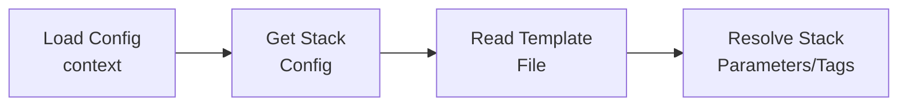
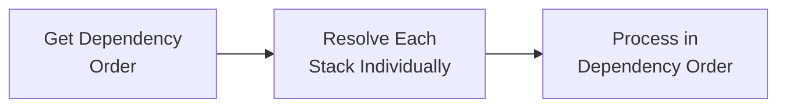
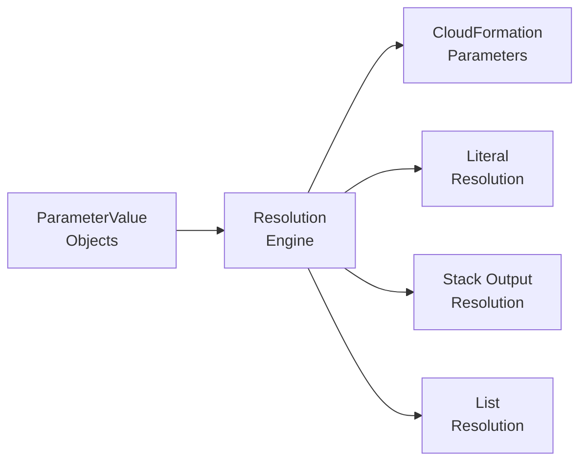
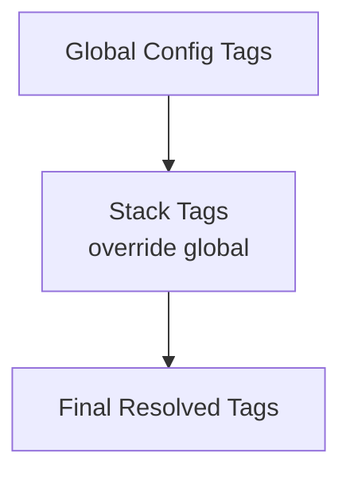
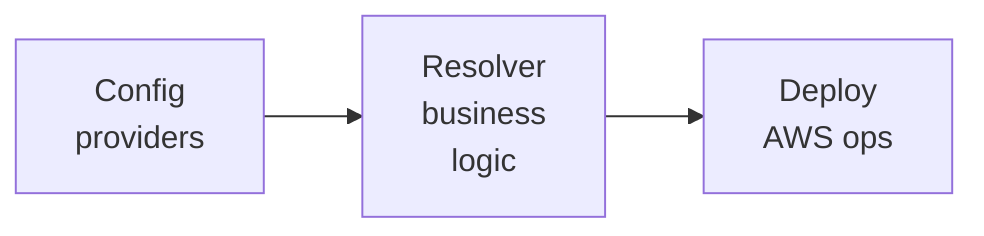
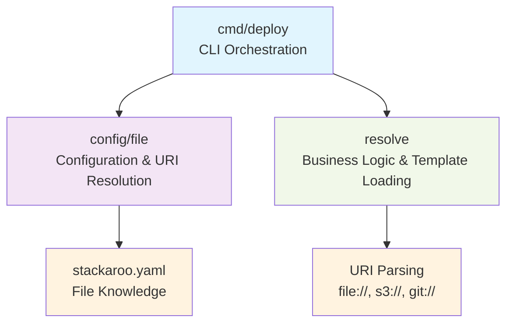

# Resolver Module Architecture

## Overview

The resolver module is responsible for transforming high-level configuration into deployment-ready artifacts. It serves as the bridge between the configuration system and the deployment system, handling dependency resolution, parameter inheritance, and template processing.

## Design Principles

### 1. **Format Agnostic**
- No knowledge of YAML, JSON, or other configuration formats
- Works with abstract configuration types from the config package
- Pure business logic focused on resolution and transformation

### 2. **Dependency Injection**
- Accepts `config.ConfigProvider` interface for configuration access
- Accepts `TemplateReader` interface for template file access
- Fully testable through interface mocking

### 3. **Single Responsibility**
- **Only** responsible for resolving configuration into deployment artifacts
- Does not handle deployment, file I/O, or format parsing
- Clear separation from configuration loading and AWS operations

### 4. **Deterministic Behavior**
- Dependency resolution produces consistent, repeatable ordering
- Parameter inheritance follows predictable precedence rules
- All operations are stateless and side-effect free

## Architecture Components

### Core Types

```go
type StackResolver struct {
    configProvider     config.ConfigProvider
    fileSystemResolver FileSystemResolver
    cfnOperations      aws.CloudFormationOperations
}

type ResolvedStack struct {
    Name         string
    TemplateBody string
    Parameters   map[string]string
    Tags         map[string]string
    Capabilities []string
    Dependencies []string
}
```

### Interfaces

#### ConfigProvider (from config package)
```go
type ConfigProvider interface {
    LoadConfig(ctx context.Context, context string) (*Config, error)
    GetStack(stackName, context string) (*StackConfig, error)
    ListContexts() ([]string, error)
    Validate() error
}
```

#### FileSystemResolver
```go
type FileSystemResolver interface {
    Resolve(templateURI string) (string, error)
}
```

#### Configuration Types
```go
type StackConfig struct {
    Name         string
    Template     string
    Parameters   map[string]*ParameterValue  // Rich parameter resolution model
    Tags         map[string]string
    Dependencies []string
    Capabilities []string
}

type ParameterValue struct {
    ResolutionType   string            // "literal", "stack-output", "list"
    ResolutionConfig map[string]string // Resolution-specific configuration
    ListItems        []*ParameterValue // For list parameters
}
```

## Resolution Process

### 1. Single Stack Resolution



**Steps:**
1. **Load Configuration** - Get global config for context
2. **Get Stack Config** - Retrieve stack-specific configuration with `ParameterValue` structures
3. **Read Template** - Load CloudFormation template content from URI
4. **Resolve Parameters** - Process `ParameterValue` objects using resolution engine
5. **Merge Tags** - Combine global and stack tags
6. **Create ResolvedStack** - Package everything together with resolved parameter strings

### 2. Multi-Stack Resolution



**Steps:**
1. **Calculate Dependency Order** - Use GetDependencyOrder() to get deployment order
2. **Build Dependency Graph** - Create adjacency list from dependencies
3. **Topological Sort** - Use Kahn's algorithm for deployment order
4. **Detect Cycles** - Identify circular dependencies and fail fast
5. **Individual Resolution** - Resolve each stack as needed using ResolveStack()

## Dependency Management

### Topological Sorting Algorithm

The resolver uses **Kahn's algorithm** for dependency resolution:

1. **Build Graph** - Create adjacency list from stack dependencies
2. **Calculate In-Degrees** - Count incoming dependencies for each stack
3. **Initialize Queue** - Add stacks with zero dependencies
4. **Process Queue** - Remove nodes, update in-degrees, add newly eligible stacks
5. **Detect Cycles** - If not all stacks processed, circular dependency exists

### Dependency Features

- **Missing Dependencies** - Dependencies not in resolution set are ignored
- **Deterministic Ordering** - Queue is sorted for consistent results
- **Cycle Detection** - Fails fast with clear error messages
- **Complex Chains** - Handles deep dependency hierarchies (A→B→C→D)

### Example Dependency Resolution

```yaml
# Configuration
stacks:
  - name: vpc
    dependencies: []
  - name: security
    dependencies: [vpc]
  - name: database
    dependencies: [security]
  - name: app
    dependencies: [database]

# Resolved Order: vpc → security → database → app
```

## Parameter Resolution System

### Parameter Resolution Architecture

The resolver includes a sophisticated parameter resolution system that transforms `ParameterValue` objects into final string values for CloudFormation.



### Resolution Types

#### **Literal Parameters**
Direct string values used as-is:
```go
paramValue := &ParameterValue{
    ResolutionType: "literal",
    ResolutionConfig: map[string]string{
        "value": "production",
    },
}
// Resolves to: "production"
```

#### **Stack Output Parameters**
Dynamic references to CloudFormation stack outputs:
```go
paramValue := &ParameterValue{
    ResolutionType: "stack-output",
    ResolutionConfig: map[string]string{
        "stack_name": "vpc-stack",
        "output_key": "VpcId",
    },
}
// Resolves to: "vpc-12345abc" (fetched from CloudFormation)
```

#### **List Parameters**
Arrays supporting mixed resolution types:
```go
paramValue := &ParameterValue{
    ResolutionType: "list",
    ListItems: []*ParameterValue{
        {
            ResolutionType: "literal",
            ResolutionConfig: map[string]string{"value": "sg-123"},
        },
        {
            ResolutionType: "stack-output",
            ResolutionConfig: map[string]string{
                "stack_name": "security-stack",
                "output_key": "WebSGId",
            },
        },
    },
}
// Resolves to: "sg-123,sg-456" (comma-separated for CloudFormation)
```

### Resolution Engine

The resolver uses a unified resolution method:

```go
func (r *StackResolver) resolveSingleParameter(ctx context.Context, paramValue *ParameterValue, context string) (string, error) {
    switch paramValue.ResolutionType {
    case "literal":
        return paramValue.ResolutionConfig["value"], nil
    case "stack-output":
        return r.resolveStackOutput(ctx, paramValue.ResolutionConfig, context)
    case "list":
        return r.resolveParameterList(ctx, paramValue.ListItems, context)
    default:
        return "", fmt.Errorf("unsupported resolution type '%s'", paramValue.ResolutionType)
    }
}
```

### List Parameter Processing

List parameters are resolved recursively and joined with commas:

1. **Iterate List Items** - Process each `ParameterValue` in `ListItems`
2. **Resolve Each Item** - Use `resolveSingleParameter()` for each item
3. **Filter Empty Values** - Remove empty resolved values
4. **Join Values** - Combine with commas for CloudFormation compatibility

```go
func (r *StackResolver) resolveParameterList(ctx context.Context, listItems []*ParameterValue, context string) (string, error) {
    var resolvedValues []string

    for i, item := range listItems {
        resolvedValue, err := r.resolveSingleParameter(ctx, item, context)
        if err != nil {
            return "", fmt.Errorf("failed to resolve list item %d: %w", i, err)
        }

        if resolvedValue != "" {
            resolvedValues = append(resolvedValues, resolvedValue)
        }
    }

    return strings.Join(resolvedValues, ","), nil
}
```

## Tag Inheritance

### Inheritance Hierarchy



### Merge Strategy

**Tags:**
1. Start with global tags from configuration
2. Add/override with stack-specific tags
3. Stack tags take precedence over global tags

**Parameters:**
1. Currently: Stack parameters only
2. **Future**: Global → Stack → Context parameter inheritance

### Example Inheritance

```yaml
# Global Config
tags:
  Project: "my-project"
  Environment: "dev"

# Stack Config
tags:
  Project: "overridden-project"  # Overrides global
  Component: "web-server"        # New tag

# Result
tags:
  Project: "overridden-project"
  Environment: "dev"
  Component: "web-server"
```

### Parameter Resolution Examples

**Simple Parameters:**
```yaml
# Configuration
parameters:
  Environment: production
  InstanceType: t3.micro

# Resolution
Environment: "production"
InstanceType: "t3.micro"
```

**Mixed List Parameters:**
```yaml
# Configuration
parameters:
  SecurityGroupIds:
    - sg-baseline123
    - type: stack-output
      stack_name: security-stack
      output_key: WebSGId
    - sg-additional456

# Resolution (assuming WebSGId resolves to "sg-web789")
SecurityGroupIds: "sg-baseline123,sg-web789,sg-additional456"
```

**Cross-Stack Dependencies:**
```yaml
# Configuration
parameters:
  SubnetIds:
    - type: stack-output
      stack_name: vpc-stack
      output_key: PublicSubnet1Id
    - type: stack-output
      stack_name: vpc-stack
      output_key: PublicSubnet2Id

# Resolution
SubnetIds: "subnet-abc123,subnet-def456"
```

## Integration Architecture

### Module Dependencies



### Data Flow

1. **Config Provider** loads YAML, converts to config types
2. **StackResolver** transforms config types to resolved artifacts
3. **Deploy** uses resolved artifacts for AWS API calls

### CLI Integration

```go
// Example usage in deploy command
configFile := "stackaroo.yaml"  // From --config flag or default
configProvider := file.NewFileConfigProvider(configFile)
resolver := resolve.NewStackResolver(configProvider, cfnOperations)

// Get dependency order first
deploymentOrder, err := resolver.GetDependencyOrder("dev", []string{"vpc", "app"})
if err != nil {
    return fmt.Errorf("dependency order calculation failed: %w", err)
}

// Deploy each stack in dependency order
for _, stackName := range deploymentOrder {
    // ResolveStack now handles parameter resolution internally
    stack, err := resolver.ResolveStack(ctx, "dev", stackName)
    if err != nil {
        return fmt.Errorf("stack resolution failed: %w", err)
    }

    // stack.Parameters is now map[string]string with resolved values
    err = deployer.DeployStack(ctx, stack)
    // ...
}
```

## Architectural Separation Improvements

### Responsibility Boundaries

The resolver module has been designed with clear separation of concerns to prevent responsibility leaks:



### Module Responsibilities

#### **cmd/deploy Module**
- **Pure CLI orchestration** - No file system knowledge
- **Uses explicit config files** - `file.NewFileConfigProvider(configFile)` with --config flag support
- **Dependency injection** - Accepts resolver and configuration provider interfaces

#### **config/file Module**
- **Handles config file resolution** - Via --config flag with "stackaroo.yaml" default
- **Path-to-URI conversion** - Converts relative paths to `file://` URIs
- **Configuration file knowledge** - Understands YAML structure and parameter parsing
- **Parameter value parsing** - Converts YAML to `ParameterValue` structures

#### **resolve Module**
- **URI-based template loading** - No assumptions about template sources
- **Parameter resolution engine** - Processes `ParameterValue` objects into final strings
- **Business logic only** - Dependency resolution, parameter resolution, tag inheritance
- **Template preprocessing** - Handles multiple URI schemes (file://, s3://, git://)

### URI-Based Template Architecture

Templates are now handled as URIs throughout the system:

```go
// Before: Path-based (leaky abstraction)
type StackConfig struct {
    Template string  // Assumed to be file path
}

// After: URI-based (clean abstraction)
type StackConfig struct {
    Template string  // URI: file://, s3://, git://, etc.
}

// Resolver handles URI parsing and loading
type TemplateReader interface {
    ReadTemplate(templateURI string) (string, error)
}
```

### Benefits of New Architecture

1. **No Hardcoded Filenames** - `cmd` module doesn't know about "stackaroo.yaml"
2. **URI Flexibility** - Templates can come from files, S3, Git, HTTP, etc.
3. **Clean Boundaries** - Each module has single, clear responsibility
4. **Testable Design** - Easy to mock template sources via URI interfaces
5. **Future Extensibility** - New template sources require no changes to cmd/config modules

## Error Handling

### Error Categories

1. **Configuration Errors**
   - Context not found
   - Stack not found
   - Invalid configuration

2. **Template Errors**
   - Template file not found
   - Template read permission errors

3. **Dependency Errors**
   - Circular dependencies
   - Invalid dependency references

4. **Parameter Resolution Errors**
   - Unsupported resolution types
   - Missing stack output references
   - Invalid parameter configurations
   - List item resolution failures

5. **Resolution Errors**
   - Parameter inheritance conflicts
   - Missing required fields

### Error Propagation

- **Wrapped Errors** - All errors include context about what failed
- **Early Failure** - Stop resolution at first error
- **Clear Messages** - Error messages include stack names and contexts
- **No Partial Results** - Either complete success or complete failure

## Testing Strategy

### Mock-Based Testing

```go
type MockConfigProvider struct {
    mock.Mock
}

func (m *MockConfigProvider) LoadConfig(ctx context.Context, context string) (*config.Config, error) {
    args := m.Called(ctx, context)
    return args.Get(0).(*config.Config), args.Error(1)
}
```

### Test Coverage Areas

1. **Happy Path** - Successful single and multi-stack resolution
2. **Error Scenarios** - Config load, stack not found, template read failures
3. **Dependency Logic** - Complex chains, cycles, missing dependencies
4. **Inheritance** - Parameter and tag merging with overrides
5. **Edge Cases** - Empty stack lists, stacks with no dependencies

### Testing Principles

- **Interface-Based** - Mock all external dependencies
- **Deterministic** - All tests produce consistent results
- **Comprehensive** - Cover all code paths and error conditions
- **Fast** - No I/O operations, pure unit tests

## Performance Considerations

### Resolution Complexity

- **Single Stack**: O(1) - Constant time operations
- **Multi-Stack**: O(V + E) - Where V = stacks, E = dependencies
- **Topological Sort**: Linear time complexity
- **Memory Usage**: Proportional to number of stacks and dependencies

### Optimization Features

- **Stateless Operations** - No caching or state management overhead
- **Minimal Allocations** - Reuse maps and slices where possible
- **Early Termination** - Stop on first error or cycle detection
- **Sorted Processing** - Deterministic ordering without performance penalty

## Extension Points

### Adding New Resolution Logic

1. **Parameter Resolver Types** - Add SSM, Secrets Manager, Lambda-invoke resolvers
2. **Template Processing** - Add template validation or transformation
3. **Dependency Types** - Support different dependency relationships
4. **Output Formats** - Generate different artifact types
5. **Parameter Validation** - Validate parameters against CloudFormation template schemas

### Template Reader Implementations

```go
// File-based templates (handles file:// URIs)
type FileTemplateReader struct{}

func (ftr *FileTemplateReader) ReadTemplate(templateURI string) (string, error) {
    // Parses file:// URI and reads from local filesystem
    // Supports both file://path and relative path formats
}

// S3-based templates (handles s3:// URIs)
type S3TemplateReader struct{}

func (str *S3TemplateReader) ReadTemplate(templateURI string) (string, error) {
    // Parses s3://bucket/key URI and reads from S3
}

// Git-based templates (handles git:// URIs)
type GitTemplateReader struct{}

func (gtr *GitTemplateReader) ReadTemplate(templateURI string) (string, error) {
    // Parses git://repo/branch/path URI and reads from Git
}
```

### Future Enhancements

1. **Enhanced Parameter Resolvers** - SSM Parameter Store, AWS Secrets Manager, Lambda functions
2. **Template Validation** - Validate CloudFormation syntax during resolution
3. **Conditional Dependencies** - Dependencies based on parameter values
4. **Template Preprocessing** - Jinja2-style template processing
5. **Parallel Resolution** - Resolve independent stacks concurrently
6. **Resolution Caching** - Cache resolved artifacts for performance
7. **Parameter Schema Validation** - Validate parameter types against CloudFormation templates

## Security Considerations

### Input Validation

- **Template URIs** - Validate URI schemes and prevent malicious URIs
- **Parameter Values** - Sanitize user inputs
- **Stack Names** - Validate naming conventions

### Template Security

- **Template Sources** - Validate template URI schemes and origins
- **URI Parsing** - Safe parsing of file://, s3://, git:// URIs
- **Content Scanning** - Basic checks for malicious content
- **Size Limits** - Prevent memory exhaustion from large templates

### Dependency Validation

- **Cycle Prevention** - Robust circular dependency detection
- **Depth Limits** - Prevent excessive dependency chains
- **Name Validation** - Ensure dependency references are valid

This architecture provides a robust, testable, and extensible foundation for configuration resolution while maintaining clear separation of concerns and following clean architecture principles.
