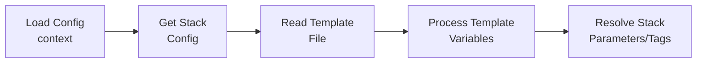
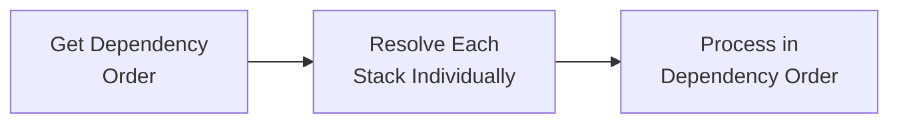

# Resolver Module Architecture

## Overview

The resolver module is responsible for transforming high-level configuration into deployment-ready artifacts. It serves as the bridge between the configuration system and the deployment system, handling dependency resolution, parameter inheritance, and template processing.

## Design Principles

### 1. **Format Agnostic**
- No knowledge of YAML, JSON, or other configuration formats
- Works with abstract configuration types from the config package
- Pure business logic focused on resolution and transformation

### 2. **Dependency Injection**
- Accepts `config.ConfigProvider` interface for configuration access
- Accepts `TemplateReader` interface for template file access
- Fully testable through interface mocking

### 3. **Single Responsibility**
- **Only** responsible for resolving configuration into deployment artifacts
- Does not handle deployment, file I/O, or format parsing
- Clear separation from configuration loading and AWS operations

### 4. **Deterministic Behavior**
- Dependency resolution produces consistent, repeatable ordering
- Parameter inheritance follows predictable precedence rules
- All operations are stateless and side-effect free

## Architecture Components

### Core Types

```go
type StackResolver struct {
    configProvider     config.ConfigProvider
    fileSystemResolver FileSystemResolver
    clientFactory      aws.ClientFactory
    templateProcessor  TemplateProcessor
}

type ResolvedStack struct {
    Name         string
    TemplateBody string
    Parameters   map[string]string
    Tags         map[string]string
    Capabilities []string
    Dependencies []string
}
```

### Interfaces

#### ConfigProvider (from config package)
```go
type ConfigProvider interface {
    LoadConfig(ctx context.Context, context string) (*Config, error)
    GetStack(stackName, context string) (*StackConfig, error)
    ListContexts() ([]string, error)
    Validate() error
}
```

#### FileSystemResolver
```go
type FileSystemResolver interface {
    Resolve(templateURI string) (string, error)
}
```

#### TemplateProcessor
```go
type TemplateProcessor interface {
    Process(templateContent string, variables map[string]interface{}) (string, error)
}
```

#### Configuration Types
```go
type StackConfig struct {
    Name         string
    Template     string
    Parameters   map[string]*ParameterValue  // Rich parameter resolution model
    Tags         map[string]string
    Dependencies []string
    Capabilities []string
}

type ParameterValue struct {
    ResolutionType   string            // "literal", "stack-output", "list"
    ResolutionConfig map[string]string
    ListItems        []*ParameterValue
}
```

## Resolution Process

### 1. Single Stack Resolution



**Steps:**
1. **Load Configuration** - Get global config for context
2. **Get Stack Config** - Retrieve stack-specific configuration with `ParameterValue` structures
3. **Read Template** - Load CloudFormation template content from URI
4. **Process Template** - Apply template variables (Context, StackName) using Go templates + Sprig
5. **Resolve Parameters** - Process `ParameterValue` objects using resolution engine
6. **Merge Tags** - Combine global and stack tags
7. **Create ResolvedStack** - Package everything together with resolved parameter strings

### 2. Multi-Stack Resolution



**Steps:**
1. **Calculate Dependency Order** - Use GetDependencyOrder() to get deployment order
2. **Build Dependency Graph** - Create adjacency list from dependencies
3. **Topological Sort** - Use Kahn's algorithm for deployment order
4. **Detect Cycles** - Identify circular dependencies and fail fast
5. **Individual Resolution** - Resolve each stack as needed using ResolveStack()

## Template Processing

### Template Variables

The resolver provides context variables to CloudFormation templates using Go templates with Sprig functions:

- **`{{ .Context }}`** - Deployment context (development, staging, production)
- **`{{ .StackName }}`** - Stack name from configuration
- **Sprig Functions** - `nindent`, `upper`, `title`, `randAlphaNum`, conditionals, etc.

### Processing Flow

1. **Read Raw Template** - Load template content from URI
2. **Build Variables** - Create template variable map with context information
3. **Process Template** - Apply Go templates + Sprig functions
4. **Output Processed Template** - Return final CloudFormation template for deployment

Templates without template directives pass through unchanged, ensuring backward compatibility.

## Dependency Management

Uses topological sorting (Kahn's algorithm) to resolve deployment order:

1. **Build Graph** - Create dependency relationships between stacks
2. **Topological Sort** - Calculate deployment order
3. **Cycle Detection** - Detect and fail on circular dependencies

Features:
- Deterministic ordering for consistent results
- Missing dependencies are ignored
- Fails fast on circular dependencies

## Parameter Resolution System

Transforms `ParameterValue` objects into final string values for CloudFormation.

### Resolution Types

- **Literal** - Direct string values
- **Stack Output** - References to CloudFormation stack outputs (supports cross-region resolution)
- **List** - Arrays supporting mixed resolution types, joined with commas

The resolution engine processes each type recursively and handles complex nested structures.

## Tag Inheritance

Simple merge strategy:
1. Start with global tags from configuration
2. Add/override with stack-specific tags
3. Stack tags take precedence over global tags

## Integration Architecture

Data flow: Config Provider → StackResolver → Deploy

- **Config Provider** loads YAML, converts to config types
- **StackResolver** transforms config to resolved artifacts (including template processing)
- **Deploy** uses resolved artifacts for AWS API calls

Templates are handled as URIs (file://, s3://, git://) for flexibility and clean separation of concerns.

## Error Handling

All errors are wrapped with context and fail fast. Categories include configuration errors, template errors, dependency errors, and parameter resolution errors.

## Testing Strategy

Uses mock-based testing with interface injection. Coverage includes happy path, error scenarios, dependency logic, and inheritance patterns.

## Cross-Region Resolution

The resolver supports cross-region stack output resolution via the ClientFactory pattern:

### Multi-Region Stack Dependencies

```go
// Example: VPC stack in us-east-1, application stack in eu-west-1
parameters:
  VpcId:
    type: stack-output
    stack: vpc-foundation
    output: VpcId
    region: us-east-1  # Cross-region reference
```

### Resolution Process

1. **Region Detection** - Extract region from parameter configuration or stack context
2. **Client Selection** - ClientFactory creates region-specific CloudFormation client
3. **Output Retrieval** - Query stack outputs from target region
4. **Parameter Injection** - Resolved value used in target stack deployment

This enables complex multi-region architectures where foundational resources (VPCs, DNS zones) in one region support applications deployed across multiple regions.

## Extension Points

The resolver is designed for extensibility:
- New parameter resolver types (SSM, Secrets Manager, etc.)
- Additional template sources (S3, Git, HTTP)
- Enhanced template processing and validation

This architecture provides a robust, testable foundation for configuration resolution with clear separation of concerns.
